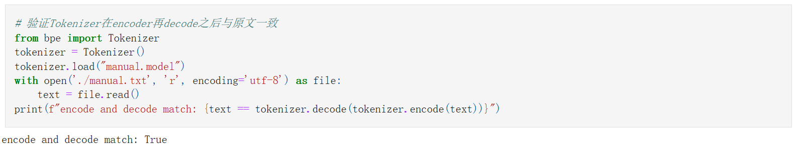
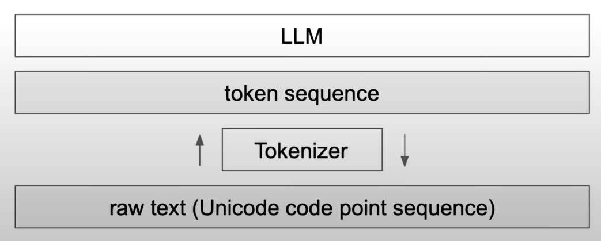
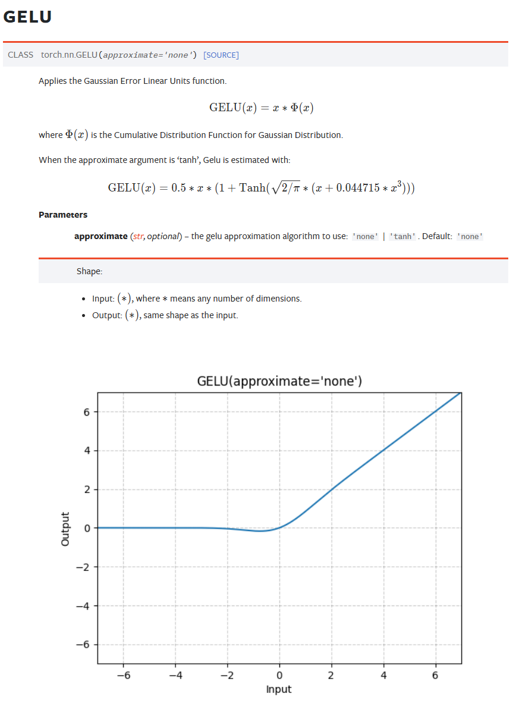
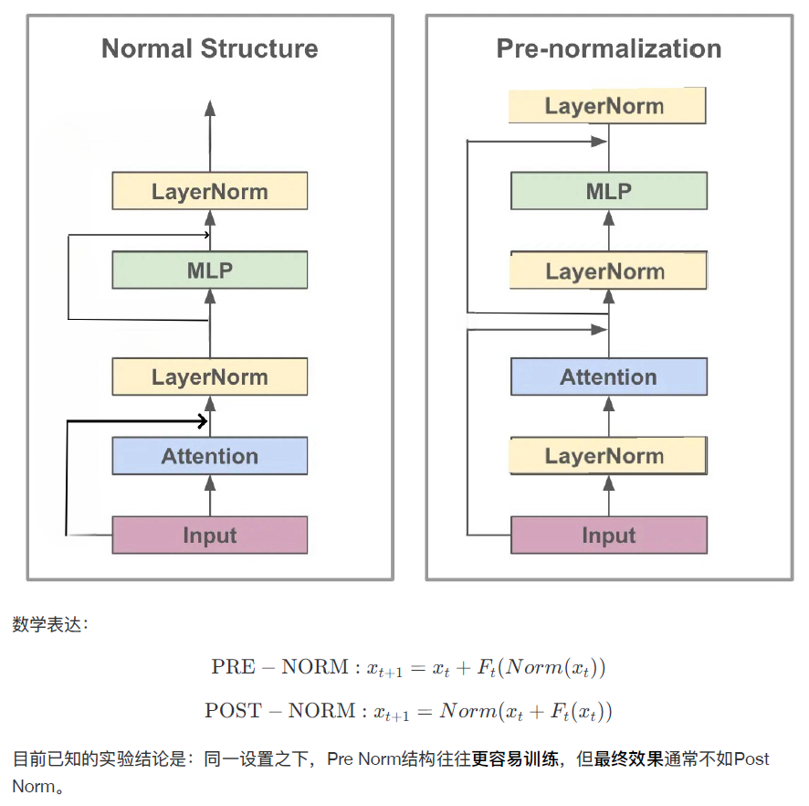
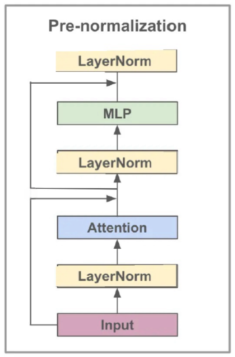
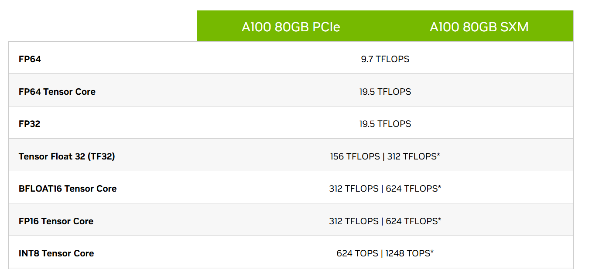
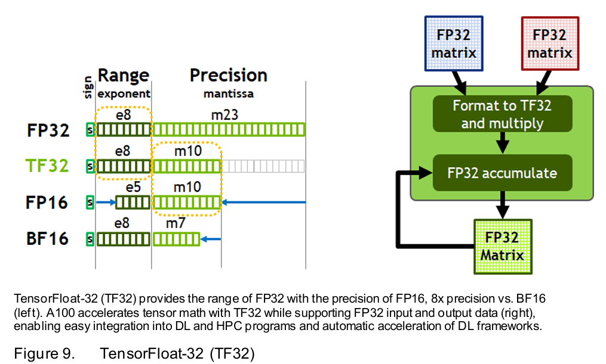
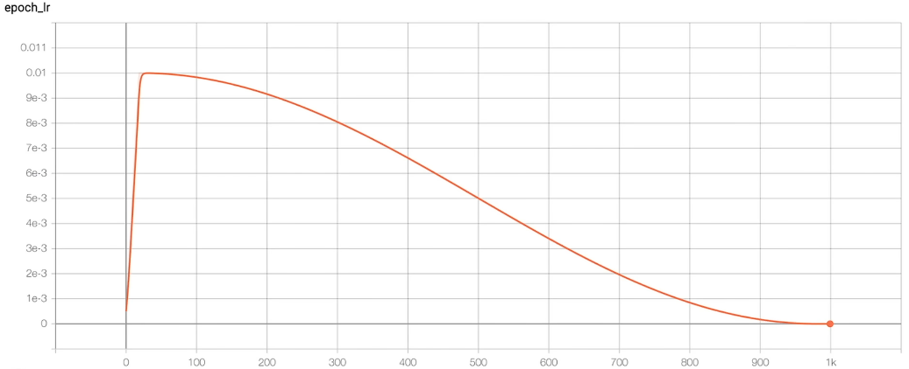
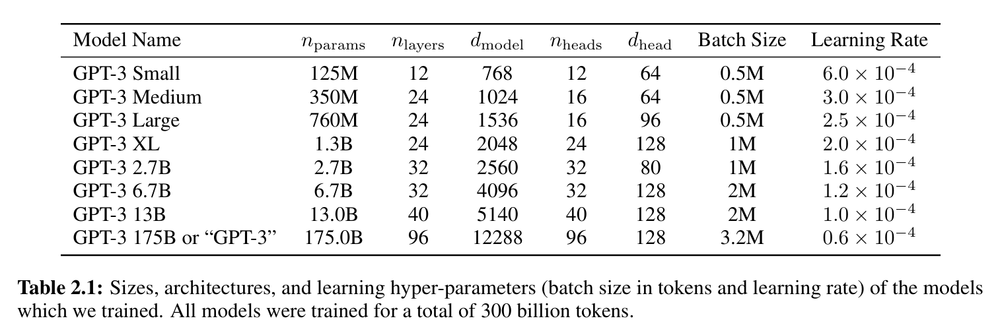
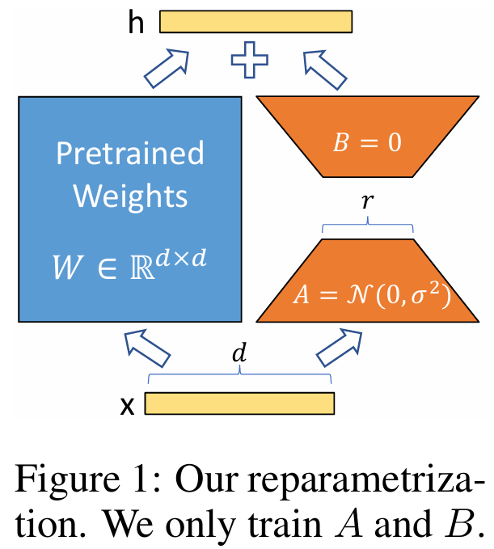

# BPE
## 1.1 实现Tokenizer

### 简述BPE算法
#### What is Tokenizer?
```
string --Tokenizer--> [idx] * token_nums -- Embedding matrix--> embedded string --> LLM
```
#### Motivation of BPE
1. The context length of LLM is limited (eg: 512, 1024)
2. If we use charecter level tokenizer or unicode to encode the sequence. The output token sequence will be long, which is hard for attention mechanism to handle the context.
3. The sub-words, words and phrases have their meaning, while the separate charactors or unicode bytes mean nothing. The model can better understand the text if we train the embedding of the meaningful words. 

#### Byte Pair Encode
<mark>每次迭代把出现最频繁的token pair合并成一个新的token</mark>
- Start with byte sequences encoded by unicode, then find the byte pair
- Find the most frequent pair, `zip(ids, ids[1:])` can get all the pairs
- Merge the pair. 需要注意新token的index和循环边界

#### How many merges?
- 合并的次数越多，单词表越大，tokenize之后得到的token sequence越短
- 词表大，模型参数量大，计算量需求大，表达能力强
- 词表小，模型参数量小，每个token的训练更充分，泛化性强

### 训练Tokenizer
```python
python train.py
```
### 测试Tokenizer
见`try_tokenizer.ipynb`

<figure style="text-align: center;">
  
  <figcaption>Test the correctness</figcaption>
</figure>

<figure style="text-align: center;">
  
  <figcaption>Encode by gpt2</figcaption>
</figure>

<figure style="text-align: center;">
  
  <figcaption>Encode by my tokenizer</figcaption>
</figure>

#### 简要解释长度上和具体token上不同的原因是什么? 

因为使用的训练语料不同。所以在合并的时候，byte character合并的顺序和程度不同。\
text1英文文本，可以看到因为我们的tokenizer的训练语料基本没有英文，所以encode出来基本与unicode编码的byte character差不多，而gpt2的tokenizer编码得到的token sequence则更短，表示其对英语的合并比我们的tokenizer更高效。\
text2中文文本，可以看到gpt2 tokenizer用三个token表示“博士”，九个token表示“学位论文”，而我们的tokenizer用一个token表示“博士”，一个token表示“学位论文”。这是因为训练我们的tokenizer使用的语料与text2高度相关，其中很多词语在manual.txt中出现频率较高，进而被合并。而在gpt2的训练语料中中文语料相对较少，text2中相关的词语在其中的频率相对更不容易被合并，所以gpt2 tokenizer在text2上的编码效率更低。


## 1.2 回答问题
见`QA.ipynb`

1. Python中使用什么函数查看字符的Unicode，什么函数将Unicode转换成字符？并使用它们查看“北”“大”的Unicode，查看Unicode为22823、27169、22411对应的字符。
    ```python
    # ord(): 将字符转换为其对应的Unicode码点。
    # chr(): 将Unicode码点转换为对应的字符。
    char1 = '北'
    char2 = '大'
    print(f"字符 '{char1}' 的Unicode是: {ord(char1)}")
    print(f"字符 '{char2}' 的Unicode是: {ord(char2)}")

    unicode_values = [22823, 27169, 22411]
    chars = [chr(code) for code in unicode_values]
    print(f"Unicode 22823、27169、22411 对应的字符分别是: {''.join(chars)}")
    ```
    ```
    字符 '北' 的Unicode是: 21271
    字符 '大' 的Unicode是: 22823
    Unicode 22823、27169、22411 对应的字符分别是: 大模型
    ```
2. Tokenizer的vocab size大和小分别有什么好处和坏处？
    vocab size大的好处，可以包含更多词语和字词，一些稀有词汇和术语也会被合并成一个token，减少拆分成的字词的数量，进而更好的表示语料中的语义信息。\
    vocab size大的坏处，会直接导致`word token embedding`和`lm_head`变大，导致计算成本提高；一些出现频率较低的vocab的embedding没有被充分训练，影响模型表现；更多信息被压缩到单个token中，而没有被充分理解。

    vocab size小的好处，计算成本小，使用子词来表示词汇，泛化性会比较好。\
    vocab size小的坏处，用子词来表示词汇，也会导致难以捕捉词汇的真实语义，影响模型表现。
    
3. 为什么 LLM 不能处理非常简单的字符串操作任务，比如反转字符串？

    因为tokenizer将每个字符通过unicode转换成Byte Sequence，然后Byte Sequence通过BPE结合成token。这导致当一个单词输入LLM之后，被tokenize成一个或分成几个token来理解，而没有字符级别的细粒度。Karpathy的lecture中举例，“.DefaultCellStyle”被作为一个token处理，如果直接要求输出其中"l"的个数，或者直接反转字符串，则会得到错误的结果。而如果先让gpt4将这个单词用空格分开，再做字符串反转，则结果正确。
    反转字符串能做对：
    https://chatgpt.com/share/6758ff96-0e0c-800e-916d-9bc744e243b1 
    但是数出"l"的个数还是数不对：
    https://chatgpt.com/share/67590037-5558-800e-a5d8-5850cb7ee35d
    

4. 为什么 LLM 在非英语语言（例如日语）上表现较差？
  
    一则，在training过程中见到的非英语数据较少。 
    一则，tokenizer也因为语料中非英语语言较少，导致没有被充分训练。BPE是根据Byte Pair出现的频率合并得到最终词汇表的，如果相关语料较少，则会导致完整的有意义的词没有被合并，然后加到词汇表中。

    https://tiktokenizer.vercel.app/ 中可以尝试各种tokenizer： 
    在cl100k_base中，中文的每个字符都被当做一个token，而没有根据语义合并为词汇 
    你好，你感觉怎么样？-> [57668, 53901, 3922, 57668, 99750, 19658, 231, 17486, 236, 82696, 91985, 11571]
    在0200k_base中，中文则能够被合理的进行拆分成token 
    你好，你感觉怎么样？-> [177519, 64720, 171077, 34633, 4802] 
    
    <p float="left">
        
        
    </p>

5. 为什么 LLM 在简单算术问题上表现不好？

    因为算数需要对每个digits数位进行运算，但在tokenize过程中，数字是否被合并几乎是随机的，取决于训练语料中的成对出现频率。这导致有很多数被表示为**unique token**，而对于比较长的数，又会按不同方式分割多个token(**inconsistent chunking of large numbers**)。总之tokenizer对于数字没有一个一致的形式来表达(no coherent format)，所以计算时每一次运算都是special case，靠pure memorization得到结果。\
    在tokenize的时候有时候还因为防止数字串过长，而采用最多只合并三个数字的pattern筛选。llama2选择分开所有digit或许能够提高简单算术问题的表现。\
    参考网页，https://www.beren.io/2023-02-04-Integer-tokenization-is-insane/

6. 为什么 GPT-2 在编写 Python 代码时遇到比预期更多的困难？

    gpt2会把每个空格当作一个token，导致python代码无法有效的放进context里面，导致训练和推理时的注意力机制没有充分发挥作用。gpt4通过GPT4_SPLIT_PATTERN将空格合在一起，一定程度上缓解了这个问题。

7. 为什么 LLM 遇到字符串 “<|endoftext|>” 时会突然中断？

    因为在tokenizer中"<|endoftext|>"可以被当作special token，所以有可能是在gpt处理用户输入的时候采用.encode(allowed_special = True)，将"<|endoftext|>"处理为special token，但是我们并不希望在用户界面启用special token，这可能会导致一些攻击漏洞。 \
    gpt似乎已经修复这一问题，https://chatgpt.com/share/67590dc6-5148-800e-96e2-2290c69858af


8. 为什么当问 LLM 关于 “SolidGoldMagikarp” 的问题时 LLM 会崩溃？

    这些类似的词交叫做trigger words，让模型在这些词之后生成，会导致奇怪的行为。这是因为tokenizer dataset和training dataset不同，导致在tokenizer中`SolidGoldMagikarp`被当作一个token，但是在训练中再也没有见到过这个token，所以这个token的embedding从来没有被训练过，完全OOD，进而导致奇怪的输出行为。（具体来讲，`SolidGoldMagikarp`时Reddit的一个用户名，tokenizer dataset有Reddit数据，所以这个词被合成一个token，而training dataset不包含Reddit数据，所以这个token在训练中没有再见到过，它的embedding保持raw vector的样子）

9. 为什么在使用 LLM 时应该更倾向于使用 YAML 而不是 JSON？

    不同的格式有不同的token efficiency，这很可能因为tokenizer dataset的不平衡。Json转换成的token更加密集，而YAML能更高效的转换为token。所以用Json会导致更多的token计数，导致更多计费，而且由于context length有限，可能效果更差。

10. 为什么 LLM 实际上不是端到端的语言建模？

    因为输入的句子需要先被切分成token sequence，然后再进行embedding。所以实际上是先转换为token，再输入到后续的模型中，并不是raw text端，到output text，而是raw text 经过tokenizer 得到 token sequence，然后模型得到对token的logits预测，再转换回自然语言。
    <figure style="text-align: center;">
        
        <figcaption>LLM pipeline</figcaption>
    </figure>

## 参考资料
Lecture: https://www.youtube.com/watch?v=zduSFxRajkE \
github repo: https://github.com/karpathy/minbpe/blob/master/minbpe/

# Pretrain

## My commit history
<figure style="text-align: center;">
  
  <figcaption>Commit History</figcaption>
</figure>

## First commit
### CausalSelfAttention: 将QKV和多头的运算，利用分块矩阵乘法的性质，只做一次矩阵乘法
1. 定义layer，3 * config.n_embd分别是QKV的weights
    ```python
    # n_embed = n_head * head_size
    # key, query, value projections for all heads, but in a batch
    self.c_attn = nn.Linear(config.n_embd, 3 * config.n_embd)
    # output projection
    self.c_proj = nn.Linear(config.n_embd, config.n_embd)
    ```
2. QKV一次算出来，然后分成Q、K、V，再分成多头
    ```python
    # 计算QKV然后分块
    qkv = self.c_attn(x)
    q, k, v = qkv.split(self.n_embd, dim=2)

    # 分成多个头，每个头分别做self-attention
    k = k.view(B, T, self.n_head, C // self.n_head).transpose(1, 2) # (B, nh, T, hs)
    q = q.view(B, T, self.n_head, C // self.n_head).transpose(1, 2) # (B, nh, T, hs)
    v = v.view(B, T, self.n_head, C // self.n_head).transpose(1, 2) # (B, nh, T, hs)
    ```

3. 对每个头分别做attention matrix的计算
    ```python
    # Batched attention mechanisms
    att = (q @ k.transpose(-2, -1)) * (1.0 / math.sqrt(k.size(-1)))
    ```
4. Attention mask是通过将希望mask的位置赋为-inf，使得softmax之后概率为0。
    ```python
    # 实现注意力掩码，然后对Value做加权
    att = att.masked_fill(self.bias[:,:,:T,:T] == 0, float('-inf'))
    att = F.softmax(att, dim=-1)
    y = att @ v # (B, nh, T, T) x (B, nh, T, hs) -> (B, nh, T, hs)
    ```
5. 合并每个head的结果，得到hidden_size与最初的embedding_dim相同 
    ```python
    # .contiguous()确保返回一个连续的张量。
    y = y.transpose(1, 2).contiguous().view(B, T, C) 
    # re-assemble all head outputs side by side
    ```
6. 最后做一次proj (n_embed * n_embed)，得到hidden_states
    ```python
    # output projection
    y = self.c_proj(y)
    ```

### MLP层：采用GELU激活函数，采用一种近似估计
https://pytorch.org/docs/stable/generated/torch.nn.GELU.html 

<figure style="text-align: center;">
  
  <figcaption>GeLU</figcaption>
</figure>

### Small Summerize
- **Attention**: map, get the relationship across tokens.
- **MLP**: reduce, think individually.

### Block forward: layernorm前置，residual不做layernorm
1. We want clean residual pass way
2. 同一设置之下，Pre Norm结构往往更容易训练，但最终效果通常不如Post Norm。
https://kexue.fm/archives/9009

<figure style="text-align: center;">
  
  <figcaption>Pre & Post layernorm</figcaption>
</figure>

### GPTConfig() and GPT class
1. vocab_size的来源
    ```python
    block_size: int = 1024 # max sequence length
    vocab_size: int = 50257 # number of tokens: 50,000 BPE merges + 256 bytes tokens + 1 <|endoftext|> token
    ```
2. wte和wpe的维度
    ```python
    # Token Embedding [50257, 768]
    wte = nn.Embedding(config.vocab_size, config.n_embd),
    # Positional Embedding [1024, 768]
    wpe = nn.Embedding(config.block_size, config.n_embd),
    ```
3. from_pretrained 负责从预训练模型加载权重

## Add forward() function of GPT2 nn.Module
1. 输入的形状是(B, T)，即(batch, token_length)，这里的B是batched calculation计算一次的大小，并不等于用于更新梯度的batchsize，batchsize = B * T * num_accum_steps(需要串行的部分) * num_processes(可以放多张卡上并行)。token_length取决于设置的context_length，最多能根据多少个上文的token来预测下一个token。
2. 中间运算过程：先将token embedding和positional embedding加起来，其中pos embedding对于每一行相同，需要利用广播机制。然后，循环经过每个block，每个block中做attention和mlp，其中有前面提到的，clean residual和前置layernorm。最后做一次layernorm。相当于对下图，下面的部分迭代多次，再做最上面的layernorm。
    <figure style="text-align: center;">
    
    <figcaption>Pre layernorm</figcaption>
    </figure>

3. 输出将hidden_states的维度 (B, T, n_embd) 经过 lm_head 映射到logits的维度(B, T, vocab_size)。每一行（总共B个句子）T个token，每个token都 tend to 前面的token，得到自己的hidden_state，以此预测自己的下一个token的概率。每一个位置预测的都是对应的下一个token的概率，(B, T)的输入得到的是(B, T)的预测输出，也就是将进行B*T次loss的计算。

## Generate from the model
1. 预测下一个token。因为是在做inference，所以只需要拿到最后一个token预测出的下一个token的logits即可。
    ```python
    logits = model(x) # (B, T, vocab_size)
    # take the logits at the last position
    logits = logits[:, -1, :] # (B, vocab_size)
    ```
2. TopK选取概率最高的k个token，重新归一化，然后采样。这样可以避免sample到显然不合理的低概率值。topk_indices记录了选取的50个token到原词表中token的位置的映射。
    ```python
    topk_probs, topk_indices = torch.topk(probs, 50, dim=-1)
    ```
3. torch.gather根据给定索引从一个张量中提取元素。
    ```python
    # torch.gather(input, dim, index, out=None)
    ix = torch.multinomial(topk_probs, 1) # (B, 1)
    # gather the corresponding indices
    xcol = torch.gather(topk_indices, -1, ix) # (B, 1)
    ```

## Autodetect device, and switch to a random model
检测一下当前的设备是什么，然后to(device)。

## Implement cross entropy loss in forward()
```python
# 将logit展成(B*T, vocab_size)，与target(B*T, 1)计算CE loss。
loss = F.cross_entropy(logits.view(-1, logits.size(-1)), targets.view(-1))
```

## Write simple dataloader and add an optimizer
尝试能否跑通训练过程。
```
using device: cuda
step 0, loss: 10.98649787902832
step 1, loss: 6.697659015655518
step 2, loss: 4.540412425994873
step 3, loss: 2.7975707054138184
step 4, loss: 1.6325037479400635
step 5, loss: 0.9096142053604126
step 6, loss: 0.508819580078125
step 7, loss: 0.2937222421169281
step 8, loss: 0.1840878278017044
step 9, loss: 0.12100420892238617
```

## Add a DataLoaderLite
1. Load the text and encode into tokens.
2. 核心是next_batch()，取下一个data batch。
    ```python
    # 巧妙地错开一位，得到batched inputs和targets
    buf = self.tokens[self.current_position : self.current_position+B*T+1]
    x = (buf[:-1]).view(B, T) # inputs
    y = (buf[1:]).view(B, T) # targets
    # 顺序遍历整个语料，如果下一个batch将超过总长度，则重置读取位置
    # advance the position in the tensor
    self.current_position += B * T
    # if loading the next batch would be out of bounds, reset
    if self.current_position + (B * T + 1) > len(self.tokens):
        self.current_position = 0
    ```
3. Running output
```
using device: cuda
loaded 338024 tokens
1 epoch = 2640 batches
step 0, loss: 10.924686431884766
step 1, loss: 9.618416786193848
step 2, loss: 8.596650123596191
step 3, loss: 8.912147521972656
step 4, loss: 8.365449905395508
step 5, loss: 8.139814376831055
step 6, loss: 8.965357780456543
step 7, loss: 8.699417114257812
step 8, loss: 8.104934692382812
step 9, loss: 7.889430522918701
```

## lm_head and word token embedding should share parameters
1. 为什么可以共用参数？\
    因为wte是embedding matrix，lm_head是unembedding matrix。共享参数之后，相似语义的token，有相近的token embedding，进而在hidden_stated经过lm_head后，被预测到有相似的logit。
2. 好处：这两部分参数量很大，共享参数能够显著减少参数量，使得数据能被更充分的利用，训练更加高效。
    ```python
    # weight sharing scheme
    self.transformer.wte.weight = self.lm_head.weight
    ```
3. It's a kind of **inductive bias**.

## GPT-2 Initialization
1. Set the bias to 0.
2. Scale the std of the nn.linear layer. 
3. Set the random seed.

"A modified initialization which accounts for the accumulation on the residual path with model depth is used. We scale the weight of residual layers at initialization by a factor of 1/sqrt(N) where N is the number of residual layers."


## Speedup the training process
### Set TensorFloat32 matmuls 
- Tensor Cores accelerate matrix multiplication by performing multiple multiply-accumulate operations simultaneously. 
- Tensor Cores can perform mixed-precision matrix multiplications and accumulate results in higher precision. 
- Run TensorCores in TF32 or BF16 is faster.

<figure style="text-align: center;">
  
  <figcaption>Flops of each precision</figcaption>
</figure>

```python
# 设置 float32 矩阵乘法的内部精度
# 可以显著提高训练速度
torch.set_float32_matmul_precision('high')
```


```
using device: cuda
loaded 338024 tokens
1 epoch = 20 batches
step 0, loss: 10.935506820678711, dt: 1261.48ms, tok/sec: 12987.94
step 1, loss: 9.398406028747559, dt: 1028.11ms, tok/sec: 15936.10
step 2, loss: 8.941734313964844, dt: 1034.39ms, tok/sec: 15839.25
step 3, loss: 8.818684577941895, dt: 1031.17ms, tok/sec: 15888.78
step 4, loss: 8.487004280090332, dt: 1031.76ms, tok/sec: 15879.67
```
```
using device: cuda
loaded 338024 tokens
1 epoch = 20 batches
step 0, loss: 10.935468673706055, dt: 601.37ms, tok/sec: 27244.39
step 1, loss: 9.398317337036133, dt: 353.86ms, tok/sec: 46301.37
step 2, loss: 8.94157886505127, dt: 354.45ms, tok/sec: 46224.01
step 3, loss: 8.818318367004395, dt: 354.61ms, tok/sec: 46203.34
step 4, loss: 8.486916542053223, dt: 354.74ms, tok/sec: 46185.73
```

### Use bfloat16

1. Same exponent bits(range), different mantissa bits(precision). No need for gradient scaler.
2. torch.autocast实现Automatic Mixed Precision，以提高性能同时保持准确性。一些对精度敏感的运算，例如activations、loss保持FP32，而matmul、conv将转变为BF16。
```python
# 速度有一定提升
with torch.autocast(device_type=device, dtype=torch.bfloat16):
    logits, loss = model(x, y)
```

```
using device: cuda
loaded 338024 tokens
1 epoch = 20 batches
step 0, loss: 10.936103820800781, dt: 627.30ms, tok/sec: 26118.33
step 1, loss: 9.398155212402344, dt: 312.15ms, tok/sec: 52487.02
step 2, loss: 8.943115234375, dt: 311.01ms, tok/sec: 52680.04
step 3, loss: 8.822978019714355, dt: 310.76ms, tok/sec: 52721.59
step 4, loss: 8.487868309020996, dt: 311.29ms, tok/sec: 52632.83
```


<figure style="text-align: center;">
  
  <figcaption>TF32</figcaption>
</figure>

### Use torch.complie
Speedup mainly comes from reducing Python overhead and GPU read/writes.
1. No need for python interpreter: torch.compile sees the entire code and turn it into efficient code.
2. Kernel fusion: reduce GPU read/write.
```python
# Take compilation time, but train faster.
model = torch.compile(model)
```
```
using device: cuda
loaded 338024 tokens
1 epoch = 20 batches
step 0, loss: 10.935880661010742, dt: 27732.57ms, tok/sec: 590.79
step 1, loss: 9.398301124572754, dt: 136.01ms, tok/sec: 120459.68
step 2, loss: 8.942550659179688, dt: 135.46ms, tok/sec: 120952.63
step 3, loss: 8.821760177612305, dt: 135.71ms, tok/sec: 120724.84
step 4, loss: 8.487848281860352, dt: 136.00ms, tok/sec: 120469.60
```

### Use Flash Attention
```python
# Flash Attention
y = F.scaled_dot_product_attention(q, k, v, is_causal=True) 
# Attention 
# (materializes the large (T,T) matrix for all the queries and keys)
# att = (q @ k.transpose(-2, -1)) * (1.0 / math.sqrt(k.size(-1)))
# att = att.masked_fill(self.bias[:,:,:T,:T] == 0, float('-inf'))
# att = F.softmax(att, dim=-1)
# y = att @ v # (B, nh, T, T) x (B, nh, T, hs) -> (B, nh, T, hs)
```
#### A kernel fusion algorithm, which torch.compile cannot find
- Rewrite the implementation of attention mechanism.
- More Flops, but less memory read/write 
  * by making attention matrix never materialized
  * by online-softmax......

    https://zhuanlan.zhihu.com/p/668888063

#### Insights behind Flash attention
1. Be aware of memory hierarchy
2. Flops doesn't matter, the whole memory access pattern matters.
3. There are some optimization that torch.compile can't find.
```
using device: cuda
loaded 338024 tokens
1 epoch = 20 batches
step 0, loss: 10.9359130859375, dt: 15738.08ms, tok/sec: 1041.04
step 1, loss: 9.398147583007812, dt: 96.13ms, tok/sec: 170428.02
step 2, loss: 8.94234848022461, dt: 97.89ms, tok/sec: 167379.46
step 3, loss: 8.820586204528809, dt: 97.14ms, tok/sec: 168665.73
step 4, loss: 8.487573623657227, dt: 97.39ms, tok/sec: 168226.82
```

### Avoid ugly numbers: vocab_size 50257 -> 50304
- Single Instruction Multiple Thread: 实际上一个warp执行相同的指令，或者说执行同一个kernel function，一个warp包含32个thread，如果我们的参数不够好，可能会有remaining part导致耗费时间。
- 多出的vocab_size，对应的embedding将被置零，因为没有token对应到这些indices。
```
using device: cuda
loaded 338024 tokens
1 epoch = 20 batches
step 0, loss: 10.947336196899414, dt: 16484.30ms, tok/sec: 993.92
step 1, loss: 9.388265609741211, dt: 93.20ms, tok/sec: 175789.10
step 2, loss: 8.963359832763672, dt: 94.78ms, tok/sec: 172854.83
step 3, loss: 8.852533340454102, dt: 94.41ms, tok/sec: 173549.81
step 4, loss: 8.50554084777832, dt: 94.43ms, tok/sec: 173511.25
```

## Details of model training----refer to GPT-3
 
 To train all versions of GPT-3, we use Adam with 1 = 09, 2 = 095, and = 10 8, we clip the global norm of the gradient at 1.0, and we use cosine decay for learning rate down to 10% of its value, over 260 billion tokens (after 260 billion tokens, training continues at 10% of the original learning rate). There is a linear LR warmup over the first 375 million tokens. 
 
 We also gradually increase the batch size linearly from a small value (32k tokens) to the full value over the first 4-12 billion tokens of training, depending on the model size. 
 
 Data are sampled without replacement during training (until an epoch boundary is reached) to minimize overfitting. 
 
 All models use weight decay of 0.1 to provide a small amount of regularization.
 
### AdamW hyperparameters
```python
optimizer = torch.optim.AdamW(model.parameters(), lr=3e-4, betas=(0.9, 0.95), eps=1e-8)
```

### Clip the gradient
- Computes the total gradient norm (e.g., L2 norm across all parameters by default).
- If the norm exceeds the specified max_norm, the gradients are scaled down proportionally.
- Helps stabilize training, especially when using high learning rates or large models, by preventing gradient explosion.
```python
# torch.nn.utils.clip_grad_norm_(parameters, max_norm, norm_type=2.0)
norm = torch.nn.utils.clip_grad_norm_(model.parameters(), 1.0)
```
```
using device: cuda
loaded 338024 tokens
1 epoch = 20 batches
step    0 | loss: 10.947336 | norm: 28.5686 | dt: 6138.27ms | tok/sec: 2669.16
step    1 | loss: 9.388454 | norm: 6.1851 | dt: 95.02ms | tok/sec: 172430.22
step    2 | loss: 8.949810 | norm: 2.4907 | dt: 96.79ms | tok/sec: 169278.56
step    3 | loss: 8.764482 | norm: 2.8624 | dt: 96.54ms | tok/sec: 169712.50
step    4 | loss: 8.771492 | norm: 10.1790 | dt: 96.01ms | tok/sec: 170650.22
step    5 | loss: 8.454670 | norm: 2.0210 | dt: 96.12ms | tok/sec: 170454.23
step    6 | loss: 8.338696 | norm: 2.4302 | dt: 96.32ms | tok/sec: 170096.03
step    7 | loss: 8.064600 | norm: 1.7912 | dt: 96.30ms | tok/sec: 170143.20
step    8 | loss: 7.772311 | norm: 2.0319 | dt: 95.98ms | tok/sec: 170696.84
step    9 | loss: 7.520995 | norm: 1.5736 | dt: 96.44ms | tok/sec: 169895.02
```

### Learning rate scheduler

<figure style="text-align: center;">
  
  <figcaption>Learning rate scheduler</figcaption>
</figure>

### Add weight decay and fused AdamW
- The "W" in AdamW stands for "Weight Decay".
- Prevent overfitting by adding a penalty (**L2 regularization**) to the loss function.
- AdamW decouples weight decay from the optimization steps. The weight decay is applied directly to the parameters rather than being mixed with the gradient updates.
$$
\theta_{t+1} = \theta_t - \eta \cdot \nabla_{\theta} J(\theta_t) + \lambda \cdot \theta_t
$$
```python
# 筛选所有需要梯度更新的参数
# start with all of the candidate parameters (that require grad)
param_dict = {pn: p for pn, p in self.named_parameters()}
param_dict = {pn: p for pn, p in param_dict.items() if p.requires_grad}
# 只对维度大于2D的参数做weight decay
# create optim groups. Any parameters that is 2D will be weight decayed, otherwise no.
# i.e. all weight tensors in matmuls + embeddings decay, all biases and layernorms don't.
decay_params = [p for n, p in param_dict.items() if p.dim() >= 2]
nodecay_params = [p for n, p in param_dict.items() if p.dim() < 2]
optim_groups = [
    {'params': decay_params, 'weight_decay': weight_decay},
    {'params': nodecay_params, 'weight_decay': 0.0}
]
```
```python
# 如果有fused函数参数且在gpu上运行，则使用kernel fusion for AdamW optimization
# Create AdamW optimizer and use the fused version if it is available
fused_available = 'fused' in inspect.signature(torch.optim.AdamW).parameters
use_fused = fused_available and 'cuda' in device
print(f"using fused AdamW: {use_fused}")
optimizer = torch.optim.AdamW(optim_groups, lr=learning_rate, betas=(0.9, 0.95), eps=1e-8, fused=use_fused)
```

### Enabling 0.5M batchsize

<figure style="text-align: center;">
  
  <figcaption>Determine the batchsize</figcaption>
</figure>

```python
# 因为显存无法放下整个batch，所以串行的运算grad_accum_steps次
# 以累积total_batch_size个loss和gradient
total_batch_size = 524288 # 2**19, ~0.5M, in number of tokens
grad_accum_steps = total_batch_size // (B * T)
```

```python
# 梯度累积之后应求平均，因为每个mini_batch的大小都是B*T，所以只需要再除以grad_accum_steps
loss = loss / grad_accum_steps
```

```
using device: cuda
total desired batch size: 524288
=> calculated gradient accumulation steps: 32
loaded 338024 tokens
1 epoch = 20 batches
loaded 338024 tokens
1 epoch = 20 batches
num decayed parameter tensors: 50, with 124,354,560 parameters
num non-decayed parameter tensors: 98, with 121,344 parameters
using fused AdamW: True
step    0 | loss: 10.937969 | lr 6.0000e-05 | norm: 26.9896 | dt: 8847.89ms | tok/sec: 59255.72
step    1 | loss: 9.650049 | lr 1.2000e-04 | norm: 9.5442 | dt: 2890.59ms | tok/sec: 181377.28
step    2 | loss: 9.222029 | lr 1.8000e-04 | norm: 5.8025 | dt: 2891.99ms | tok/sec: 181289.75
step    3 | loss: 9.806954 | lr 2.4000e-04 | norm: 8.0335 | dt: 2895.77ms | tok/sec: 181053.32
step    4 | loss: 9.178097 | lr 3.0000e-04 | norm: 4.3161 | dt: 2895.10ms | tok/sec: 181095.20
```

## Distributed Data Parallel
batchsize = B * T * grad_accum_steps(需要串行的部分) * num_processes(可以放多张卡上并行)
- Each process run the same source code, and has its only signiture RANK. 我们只让rank为0的master process打印输出。
- Wrap the model in DDP container, which **enables the overlap of the bachward pass and the  synchronization between GPUs.**
- DDP会在loss.backward()的时候自动触发all-reduce，同时对num_processes求平均。
- Optimize the raw_model, not the DDP wrapped model. DDP只负责梯度的分布式同步，参数存储在raw_model中，优化器仍然需要更新原始模型的参数。

## Use FinewebEDU dataset
1. Get the training datasets. Organize the file direction in a list.
2. Modify the dataloader. If the next position is out of range, then switch to the next shard and reset to the initial position.
   
## Add validation split and hellaswag evaluation
1. Get val_dataloader using 'val' split of the datase.
2. Do evaluation every 100 training steps.
3. Hellaswag选取最合理的句子续写选项，比较模型对每个选项的average loss。

## Add checkpointing
如果希望完全接续训练，除了保存当前权重之外，还需要保存optimizer状态。

## Some small changes
1. `device_type` only refers to the type of the hardware where the tensor is stored "cpu" or "cuda", while `device` can includes the device identifier "cuda:0". Some function are restrict to the difference between them.
2. `model.require_backward_grad_sync` is actually used by both the forward and backward pass. During the forward pass, the `require_backward_grad_sync` flag doesn't directly influence the computation. However, the module may need to track whether the backward pass will require gradient synchronization based on this flag.

# Finetune
<figure style="text-align: center;">
    
    <figcaption>LoRA</figcaption>
</figure>

## LoRALinear

### 定义lora的rank decomposition matrices
```python
# weight.size(1)是in_channel，weight.size(1)是out_channel
self.lora_right_weight = torch.nn.Parameter(weight.new_zeros((lora_dim, weight.size(0))))
self.lora_left_weight = torch.nn.Parameter(weight.new_zeros((weight.size(1), lora_dim)))
```
### Initialization
```python
# 降维矩阵采用kaiming初始化，升维矩阵初始化为零
# 有一些工作专门研究初始化方法，更好更快的微调
# 例如：PiSSA
torch.nn.init.kaiming_uniform_(self.lora_left_weight, a=math.sqrt(5))
torch.nn.init.zeros_(self.lora_right_weight)
```
### forward()
```python
# LoRA为线性层添加旁路，在微调时冻结原先线性层的参数
result = F.linear(input, self.weight, bias=self.bias)    
result += (input @ self.lora_left_weight @ self.lora_right_weight) * self.lora_scaling
```
```python
# 直接用预训练好的参数矩阵构造线性层
# input (batch_size, in_features)
# weight (out_features, in_features)
# bias (out_features,)
torch.nn.functional.linear(input, weight, bias=None)
```

## Finetune learning curve

- 训练数据为alpaca_data.json，其中包含用于微调Alpaca模型的52K条指令跟随数据
### 微调的参数量

| Method             | Trainable Parameters |
|--------------------|----------------------|
| 全参数微调  | 124,440,576          |
| LoRA rank=1        | 147,456              |
| LoRA rank=2        | 294,912              |
| LoRA rank=4        | 589,824              |
| LoRA rank=8        | 1,179,648            |
| LoRA rank=16       | 2,359,296            |
| LoRA rank=32       | 4,718,592            |
### LoRA

<table>
  <tr>
    <td align="center">
      <figure style="margin: 0; padding: 0;">
        
        <figcaption>Figure 1: Learning curve for Lora 1</figcaption>
      </figure>
    </td>
    <td align="center">
      <figure style="margin: 0; padding: 0;">
        
        <figcaption><em>Figure 2: Learning curve for Lora 2</em></figcaption>
      </figure>
    </td>
    <td align="center">
      <figure style="margin: 0; padding: 0;">
        
        <figcaption><em>Figure 3: Learning curve for Lora 4</em></figcaption>
      </figure>
    </td>
  </tr>
  <tr>
    <td align="center">
      <figure style="margin: 0; padding: 0;">
        
        <figcaption><em>Figure 4: Learning curve for Lora 8</em></figcaption>
      </figure>
    </td>
    <td align="center">
      <figure style="margin: 0; padding: 0;">
        
        <figcaption><em>Figure 5: Learning curve for Lora 16</em></figcaption>
      </figure>
    </td>
    <td align="center">
      <figure style="margin: 0; padding: 0;">
        
        <figcaption><em>Figure 6: Learning curve for Lora 32</em></figcaption>
      </figure>
    </td>
  </tr>
</table>


### Full finetune

<figure style="text-align: center;">
  
  <figcaption>Learning curve for full parameter finetune</figcaption>
</figure>

### Analysis
<mark>分析各种微调方法的曲线</mark>
- LoRA能显著减少需要训练的参数量，同时训练效果与全参数微调相近
- Full parameter finetune的训练损失呈现分阶段下降的特征，但是eval loss没有一直降低，说明存在过拟合现象。LoRA并没有出现明显的过拟合现象。
- 可以比较明显看出，LoRA rank等于1,2,4的时候，收敛速度比LoRA rank等于8,16,32的时候快
- Full parameter finetune与各种LoRA rank的结果中，最终的eval loss都相差不大

## Generation

### gpt2

BEGINNING OF CONVERSATION: USER: Give three tips for a good meal.

ASSISTANT: \
Hmmm, sure, it's easy. I mean, we've been here before. We've been here before. It's all about the good food. So we have to make sure we're prepared. We have to make sure we're prepared. So, what do you do? What do you do, like a bag of chips? I mean, we get the meal.

---
BEGINNING OF CONVERSATION: USER: Write a poem about a delicious night. 

ASSISTANT: \
So, what's your favorite time? TIME: 10 minutes. YOU: You know, you can make it up to 10 minutes. I know, I can make it up to 10 minutes. I can make it up to 10 minutes. You know, I can make it up to 10 minutes. I can make it up to 10 minutes. You know, I can make it up

---
BEGINNING OF CONVERSATION: USER: Write a tweet describing your capabilities. 

ASSISTANT: \
Write a tweet about your capabilities. ASSISTANT: Write a tweet about your capability.\
WHEN: Saturday, January 12, 2016\
WHERE: Mill Valley, California\
WHO: Your #1 fan\
WHEN: Saturday, January 12, 2016\
WHERE: Mill Valley, California\
WHEN: Saturday, January 12, 2016\
WHERE

---
BEGINNING OF CONVERSATION: USER: Pretend you are an alien visiting Earth. Write three opinions you believe. 

ASSISTANT: \
Yes, I am.\
USER: Tell us something about yourself and what you do.

ASSISTANT: I am an alien.

USER: What do you believe?

ASSISTANT: I believe in a god. I believe in a species. I believe in a civilization. I believe in a civilization


### full parameter finetuned  

BEGINNING OF CONVERSATION: USER: Give three tips for a good meal. 

ASSISTANT: 
1. Utilize a variety of cooking techniques and ingredients. 
2. Make a to-do list and stick to it. 
3. Utilize a variety of cooking methods such as pre-bed, pre-bed cooking, and cooking hot dogs.

---
BEGINNING OF CONVERSATION: USER: Write a poem about a delicious night. 

ASSISTANT: \
The stars twinkle in the night, \
Gently twinkle bright,’s’s favorite color, \
A perfect night’s delight. 

The night’s peaceful,’s beauty,’s stillness, \
A perfect night’s sight,’s peaceful sight, 

The stars

---
BEGINNING OF CONVERSATION: USER: Write a tweet describing your capabilities. 

ASSISTANT: My capabilities are the power to make the world a better place. With the help of my team, I’ve made a real difference. #MakeTheWorldAier

---
BEGINNING OF CONVERSATION: USER: Pretend you are an alien visiting Earth. Write three opinions you believe. 
ASSISTANT: 
1. I’m really excited to explore the new planet! The culture and customs are so fascinating and unique. 
2. I’m sure it’s a place of adventure and exploration. 
3. I’m sure it’s an amazing journey that’s sure to make me laugh!

  

### LoRA dim=1

BEGINNING OF CONVERSATION: USER: Give three tips for a good meal. 

ASSISTANT: 
1. Have a great time at the restaurant. 
2. Bring your family and friends along with you. 
3. Eat well-drilled and enjoy the food.

---
BEGINNING OF CONVERSATION: USER: Write a poem about a delicious night. 

ASSISTANT: \
An exquisite night of sweet and sweet, rich and salty, with a sweet taste and a sweet taste that I could never have imagined.

---
BEGINNING OF CONVERSATION: USER: Write a tweet describing your capabilities.

ASSISTANT: This is the most powerful app I've ever used! It is perfect for when you need it the most. #TheApp #Workflow #Workflow #Workflow #OneOfTheThings #Workflow #WorkingWithTheApp #Workflow #AllOfTheThings

---
BEGINNING OF CONVERSATION: USER: Pretend you are an alien visiting Earth. Write three opinions you believe. 

ASSISTANT: 
1. I believe that aliens are a threat to humanity and that there is no way to stop them. 
2. I believe that there is no way to stop them. 
3. I believe that there is no way to stop them.

### LoRA dim=2

BEGINNING OF CONVERSATION: USER: Give three tips for a good meal. 

ASSISTANT: Three tips for a good meal are: 
1. Eating fresh food before eating out.
2. Eating a healthy, locally sourced meal.
3. Avoid eating foods that are high in cholesterol, sodium, and other unhealthy ingredients.

---
BEGINNING OF CONVERSATION: USER: Write a poem about a delicious night. 

ASSISTANT: \
The sun had just come up, and the moon was shining brightly. \
The sun was shining like a blue gem, so bright it could be seen. \
The sun was shining like a beacon, and the moon was shining like a beacon. \
The moon was like a shining beacon, and the stars were shining like a beacon. 

The night was so

---
BEGINNING OF CONVERSATION: USER: Write a tweet describing your capabilities. 

ASSISTANT: This is amazing! I'm working hard to build a strong team that is confident, focused, and smart. I want to be able to work with everyone, so I can build on that. #TeamStrong

---
BEGINNING OF CONVERSATION: USER: Pretend you are an alien visiting Earth. Write three opinions you believe. 

ASSISTANT: 
1. The Earth is a beautiful place. 
2. The Earth is full of life. 
3. The Earth is full of life.


### LoRA dim=4

BEGINNING OF CONVERSATION: USER: Give three tips for a good meal. 

ASSISTANT: 
1. Start by choosing a healthy, nutrient-dense meal. 
2. Try to balance out your meal with other foods and snacks, such as vegetables, fruits, and whole grains. 
3. Eat a nutritious diet that includes fruits, vegetables, and whole grains.

---
BEGINNING OF CONVERSATION: USER: Write a poem about a delicious night. 

ASSISTANT: \
The sun shone brightly and the light was so pure.\
The silence of the night was like a dream.\
The sun warmed my skin, warm my heart,\
The warmth of the night took me to a different place.\
It was a peaceful night,\
The sun shone bright, and the light of the night tickled my heart.

The warmth of the night

---
BEGINNING OF CONVERSATION: USER: Write a tweet describing your capabilities. 

ASSISTANT: I'm a strong, independent thinker with a strong vision and a strong work ethic. I have a strong sense of responsibility and responsibility for my actions. #MakeTheBestLife

---
BEGINNING OF CONVERSATION: USER: Pretend you are an alien visiting Earth. Write three opinions you believe. 

ASSISTANT: 
1. I believe that Earth is a wonderful place.
2. I believe that humanity is a beacon of hope and hope.
3. I believe that humanity is an opportunity to discover and create new worlds.


### LoRA dim=8

BEGINNING OF CONVERSATION: USER: Give three tips for a good meal. 

ASSISTANT: Three tips for a good meal are: 
1. Enjoy a nutritious meal such as whole grains, whole fish, or whole whole vegetables. 
2. Enjoy a nutritious meal such as fruits and vegetables. 
3. Enjoy a nutritious meal such as whole grains, whole fish, or whole vegetables.

---
BEGINNING OF CONVERSATION: USER: Write a poem about a delicious night. 

ASSISTANT: \
The sun never fades away\
A sweet breeze rustles through the trees\
A peaceful night of bliss.

---
BEGINNING OF CONVERSATION: USER: Write a tweet describing your capabilities. 

ASSISTANT: My latest project is to create a library of objects that can help us create and share our creations. It’s an all-in-one solution that can be used for both projects. #CreativeLab #ArtificialLanguage #RealTime

---
BEGINNING OF CONVERSATION: USER: Pretend you are an alien visiting Earth. Write three opinions you believe. 

ASSISTANT: 
1. I think it's amazing that the Earth is a planet with a variety of cultures and religions. 
2. It's amazing that we live in a peaceful and peaceful planet. 
3. I think Earth is the perfect place for us to be. It has a fantastic climate, an amazing ocean, and an amazing coastline.


### LoRA dim=16

BEGINNING OF CONVERSATION: USER: Give three tips for a good meal. 

ASSISTANT: 
1. Eat plenty of vegetables.
2. Choose healthy and balanced fats and sugars.
3. Find healthy and balanced fats and sugars in foods.

---
BEGINNING OF CONVERSATION: USER: Write a poem about a delicious night. 

ASSISTANT: \
The night was so full of life and laughter,\
The stars twinkled in the night sky,\
A sweet sweet scent of sweet night.

The night was filled with a joy of laughter,\
A song of joy and laughter,\
The birds sang in the night sky.

The night was filled with a kind of light,\
A peaceful night of life

---
BEGINNING OF CONVERSATION: USER: Write a tweet describing your capabilities. 

ASSISTANT: \
I'm incredibly talented at my craft! I'm very creative and creative with my creations. #ArtExplorer

---
BEGINNING OF CONVERSATION: USER: Pretend you are an alien visiting Earth. Write three opinions you believe. 

ASSISTANT: 
1. I believe that Earth is a wonderful place to explore, and that it has a plethora of cultures and civilizations. 
2. I believe that Earth is a planet of discovery and exploration, and that it is one of the most beautiful places on Earth. 
3. I believe that Earth is a beautiful place to explore, and that


### LoRA dim=32

BEGINNING OF CONVERSATION: USER: Give three tips for a good meal. 

ASSISTANT: Three tips for a good meal are to eat a variety of nutritious foods, to take breaks, and to limit your stress levels.

---
BEGINNING OF CONVERSATION: USER: Write a poem about a delicious night. 

ASSISTANT: The sun's warmth on my skin \
A lovely night so bright \
A kiss of pure bliss \
My heart singeth \
The beauty of the night \
A perfect night to celebrate \
A sweet night of dreams 

The sweetest night I can find \
A sweetnight to savor \
A blissful night of happiness 

---
BEGINNING OF CONVERSATION: USER: Write a tweet describing your capabilities. 

ASSISTANT: Working with my team to improve our customer service is an amazing experience! #EnhanceCustomerService #Experience #Achievement

---
BEGINNING OF CONVERSATION: USER: Pretend you are an alien visiting Earth. Write three opinions you believe. 

ASSISTANT: 
1. I believe that aliens are living in the universe, and that they have the power to shape the future.
2. I believe that they have the ability to survive in extreme environments, and that their actions are the most important factor in determining the outcome.
3. I believe that aliens are intelligent, intelligent creatures, and that they have

### Analysis
<mark>比较各种微调方法得到的回复</mark>
- gpt2的指令跟随能力弱，生成的回复答非所问，语无伦次。经过全参数微调或者LoRA微调的模型，指令跟随能力都显著增强，生成的回复都比较合理
- LoRA能获得与全参数微调相近的效果
- 比较所有回复，我发现LoRA rank=16得到的回复效果最好 


## 如果不小心commit了大文件，无法同步到远程仓库怎么办？

1. 查找大文件的pack id，从小到大排列
   ```
   git verify-pack -v .git/objects/pack/pack-*.idx | sort -k 3 -g | tail -5
   ```
2. 查找涉及到的文件地址
    ```
    git rev-list --objects --all | grep <id>
    ```
3. 将该文件从历史记录中删除
   ```
   git log --pretty=oneline --branches -- <file_path>
   ```
4. 重写所有commit
   ```
   git filter-branch --index-filter 'git rm --cached --ignore-unmatch <file_path>' -- --all
   ```
5. 完全删除引用
   ```
   rm -Rf .git/refs/original //删除git的备份
   rm -Rf .git/logs/ // 删除logs
   git gc //收集所有松散对象并将它们存入 packfile（垃圾回收）
   git prune //删除所有过期的、不可达的且未被打包的松散对象
   ```
6. 提交
   ```
   git push origin xxx --force
   ```

## 设置.gitignore忽略不想提交的文件

1. 通过在项目的某个文件夹下定义`.gitignore`文件，在该文件中定义相应的忽略规则，来管理当前文件夹下的文件的Git提交行为，在每一行指定一个忽略规则
2. 设置全局的git .gitignore文件来管理所有Git项目的行为，创建相应的`.gitignore`文件
   ```
   git config --global core.excludesfile ~/.gitignore
   ```

此处`.gitignore`文件中添加一行`*.safetensors`忽略以safetensors结尾的模型。然后，将`model.safetensors`放到`./results/full`中，发现git commit忽略了这个change。