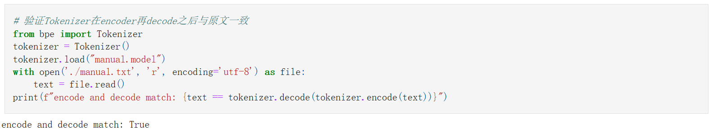
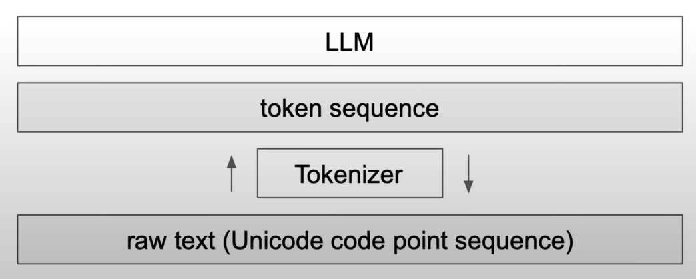

# 1.1 实现Tokenizer

## 简述BPE算法
### What is Tokenizer?
```
string --Tokenizer--> [idx] * token_nums -- Embedding matrix--> embedded string --> LLM
```
### Motivation of BPE
1. The context length of LLM is limited (eg: 512, 1024)
2. If we use charecter level tokenizer or unicode to encode the sequence. The output token sequence will be long, which is hard for attention mechanism to handle the context.
3. The sub-words, words and phrases have their meaning, while the separate charactors or unicode bytes mean nothing. The model can better understand the text if we train the embedding of the meaningful words. 

### Byte Pair Encode
<mark>每次迭代把出现最频繁的token pair合并成一个新的token</mark>
- Start with byte sequences encoded by unicode, then find the byte pair
- Find the most frequent pair, `zip(ids, ids[1:])` can get all the pairs
- Merge the pair. 需要注意新token的index和循环边界

### How many merges?
- 合并的次数越多，单词表越大，tokenize之后得到的token sequence越短
- 词表大，模型参数量大，计算量需求大，表达能力强
- 词表小，模型参数量小，每个token的训练更充分，泛化性强

## 训练Tokenizer
```python
python train.py
```
## 测试Tokenizer
见`try_tokenizer.ipynb`

<figure style="text-align: center;">
  
  <figcaption>Test the correctness</figcaption>
</figure>

<figure style="text-align: center;">
  
  <figcaption>Encode by gpt2</figcaption>
</figure>

<figure style="text-align: center;">
  
  <figcaption>Encode by my tokenizer</figcaption>
</figure>

### 简要解释长度上和具体token上不同的原因是什么? 

因为使用的训练语料不同。所以在合并的时候，byte character合并的顺序和程度不同。\
text1英文文本，可以看到因为我们的tokenizer的训练语料基本没有英文，所以encode出来基本与unicode编码的byte character差不多，而gpt2的tokenizer编码得到的token sequence则更短，表示其对英语的合并比我们的tokenizer更高效。\
text2中文文本，可以看到gpt2 tokenizer用三个token表示“博士”，九个token表示“学位论文”，而我们的tokenizer用一个token表示“博士”，一个token表示“学位论文”。这是因为训练我们的tokenizer使用的语料与text2高度相关，其中很多词语在manual.txt中出现频率较高，进而被合并。而在gpt2的训练语料中中文语料相对较少，text2中相关的词语在其中的频率相对更不容易被合并，所以gpt2 tokenizer在text2上的编码效率更低。


# 1.2 回答问题
见`QA.ipynb`

1. Python中使用什么函数查看字符的Unicode，什么函数将Unicode转换成字符？并使用它们查看“北”“大”的Unicode，查看Unicode为22823、27169、22411对应的字符。
    ```python
    # ord(): 将字符转换为其对应的Unicode码点。
    # chr(): 将Unicode码点转换为对应的字符。
    char1 = '北'
    char2 = '大'
    print(f"字符 '{char1}' 的Unicode是: {ord(char1)}")
    print(f"字符 '{char2}' 的Unicode是: {ord(char2)}")

    unicode_values = [22823, 27169, 22411]
    chars = [chr(code) for code in unicode_values]
    print(f"Unicode 22823、27169、22411 对应的字符分别是: {''.join(chars)}")
    ```
    ```
    字符 '北' 的Unicode是: 21271
    字符 '大' 的Unicode是: 22823
    Unicode 22823、27169、22411 对应的字符分别是: 大模型
    ```
2. Tokenizer的vocab size大和小分别有什么好处和坏处？
    vocab size大的好处，可以包含更多词语和字词，一些稀有词汇和术语也会被合并成一个token，减少拆分成的字词的数量，进而更好的表示语料中的语义信息。\
    vocab size大的坏处，会直接导致`word token embedding`和`lm_head`变大，导致计算成本提高；一些出现频率较低的vocab的embedding没有被充分训练，影响模型表现；更多信息被压缩到单个token中，而没有被充分理解。

    vocab size小的好处，计算成本小，使用子词来表示词汇，泛化性会比较好。\
    vocab size小的坏处，用子词来表示词汇，也会导致难以捕捉词汇的真实语义，影响模型表现。
    
3. 为什么 LLM 不能处理非常简单的字符串操作任务，比如反转字符串？

    因为tokenizer将每个字符通过unicode转换成Byte Sequence，然后Byte Sequence通过BPE结合成token。这导致当一个单词输入LLM之后，被tokenize成一个或分成几个token来理解，而没有字符级别的细粒度。Karpathy的lecture中举例，“.DefaultCellStyle”被作为一个token处理，如果直接要求输出其中"l"的个数，或者直接反转字符串，则会得到错误的结果。而如果先让gpt4将这个单词用空格分开，再做字符串反转，则结果正确。
    反转字符串能做对：
    https://chatgpt.com/share/6758ff96-0e0c-800e-916d-9bc744e243b1 
    但是数出"l"的个数还是数不对：
    https://chatgpt.com/share/67590037-5558-800e-a5d8-5850cb7ee35d
    

4. 为什么 LLM 在非英语语言（例如日语）上表现较差？
  
    一则，在training过程中见到的非英语数据较少。 
    一则，tokenizer也因为语料中非英语语言较少，导致没有被充分训练。BPE是根据Byte Pair出现的频率合并得到最终词汇表的，如果相关语料较少，则会导致完整的有意义的词没有被合并，然后加到词汇表中。

    https://tiktokenizer.vercel.app/ 中可以尝试各种tokenizer： 
    在cl100k_base中，中文的每个字符都被当做一个token，而没有根据语义合并为词汇 
    你好，你感觉怎么样？-> [57668, 53901, 3922, 57668, 99750, 19658, 231, 17486, 236, 82696, 91985, 11571]
    在0200k_base中，中文则能够被合理的进行拆分成token 
    你好，你感觉怎么样？-> [177519, 64720, 171077, 34633, 4802] 
    
    <figure style="text-align: center;">
        
        
    </figure>

5. 为什么 LLM 在简单算术问题上表现不好？

    因为算数需要对每个digits数位进行运算，但在tokenize过程中，数字是否被合并几乎是随机的，取决于训练语料中的成对出现频率。这导致有很多数被表示为**unique token**，而对于比较长的数，又会按不同方式分割多个token(**inconsistent chunking of large numbers**)。总之tokenizer对于数字没有一个一致的形式来表达(no coherent format)，所以计算时每一次运算都是special case，靠pure memorization得到结果。\
    在tokenize的时候有时候还因为防止数字串过长，而采用最多只合并三个数字的pattern筛选。llama2选择分开所有digit或许能够提高简单算术问题的表现。\
    参考网页，https://www.beren.io/2023-02-04-Integer-tokenization-is-insane/

6. 为什么 GPT-2 在编写 Python 代码时遇到比预期更多的困难？

    gpt2会把每个空格当作一个token，导致python代码无法有效的放进context里面，导致训练和推理时的注意力机制没有充分发挥作用。gpt4通过GPT4_SPLIT_PATTERN将空格合在一起，一定程度上缓解了这个问题。

7. 为什么 LLM 遇到字符串 “<|endoftext|>” 时会突然中断？

    因为在tokenizer中"<|endoftext|>"可以被当作special token，所以有可能是在gpt处理用户输入的时候采用.encode(allowed_special = True)，将"<|endoftext|>"处理为special token，但是我们并不希望在用户界面启用special token，这可能会导致一些攻击漏洞。 \
    gpt似乎已经修复这一问题，https://chatgpt.com/share/67590dc6-5148-800e-96e2-2290c69858af


8. 为什么当问 LLM 关于 “SolidGoldMagikarp” 的问题时 LLM 会崩溃？

    这些类似的词交叫做trigger words，让模型在这些词之后生成，会导致奇怪的行为。这是因为tokenizer dataset和training dataset不同，导致在tokenizer中`SolidGoldMagikarp`被当作一个token，但是在训练中再也没有见到过这个token，所以这个token的embedding从来没有被训练过，完全OOD，进而导致奇怪的输出行为。（具体来讲，`SolidGoldMagikarp`时Reddit的一个用户名，tokenizer dataset有Reddit数据，所以这个词被合成一个token，而training dataset不包含Reddit数据，所以这个token在训练中没有再见到过，它的embedding保持raw vector的样子）

9. 为什么在使用 LLM 时应该更倾向于使用 YAML 而不是 JSON？

    不同的格式有不同的token efficiency，这很可能因为tokenizer dataset的不平衡。Json转换成的token更加密集，而YAML能更高效的转换为token。所以用Json会导致更多的token计数，导致更多计费，而且由于context length有限，可能效果更差。

10. 为什么 LLM 实际上不是端到端的语言建模？

    因为输入的句子需要先被切分成token sequence，然后再进行embedding。所以实际上是先转换为token，再输入到后续的模型中，并不是raw text端，到output text，而是raw text 经过tokenizer 得到 token sequence，然后模型得到对token的logits预测，再转换回自然语言。
    <figure style="text-align: center;">
    
    <figcaption>LLM pipeline</figcaption>
    </figure>

# 参考资料
Lecture: https://www.youtube.com/watch?v=zduSFxRajkE \
github repo: https://github.com/karpathy/minbpe/blob/master/minbpe/

