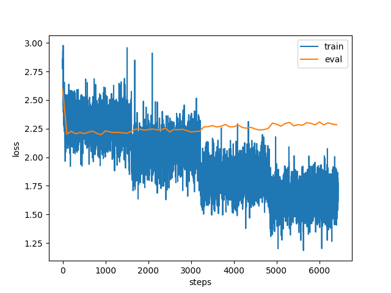

# LoRALinear

## 定义lora的rank decomposition matrices
```python
# weight.size(1)是in_channel，weight.size(1)是out_channel
self.lora_right_weight = torch.nn.Parameter(weight.new_zeros((lora_dim, weight.size(0))))
self.lora_left_weight = torch.nn.Parameter(weight.new_zeros((weight.size(1), lora_dim)))
```
## Initialization
```python
# 降维矩阵采用kaiming初始化，升维矩阵初始化为零
# 有一些工作专门研究初始化方法，更好更快的微调
# 例如：PiSSA
torch.nn.init.kaiming_uniform_(self.lora_left_weight, a=math.sqrt(5))
torch.nn.init.zeros_(self.lora_right_weight)
```
## forward()
```python
result = F.linear(input, self.weight, bias=self.bias)    
result += (input @ self.lora_left_weight @ self.lora_right_weight) * self.lora_scaling
```
```python
# input (batch_size, in_features)
# weight (out_features, in_features)
# bias (out_features,)
torch.nn.functional.linear(input, weight, bias=None)
```

# Finetune learning curve

- 训练数据为alpaca_data.json，其中包含用于微调Alpaca模型的52K条指令跟随数据
## 微调的参数量

| Method             | Trainable Parameters |
|--------------------|----------------------|
| 全参数微调  | 124,440,576          |
| LoRA rank=1        | 147,456              |
| LoRA rank=2        | 294,912              |
| LoRA rank=4        | 589,824              |
| LoRA rank=8        | 1,179,648            |
| LoRA rank=16       | 2,359,296            |
| LoRA rank=32       | 4,718,592            |
## LoRA

<table>
  <tr>
    <td align="center">
      <figure style="margin: 0; padding: 0;">
        
        <figcaption>Figure 1: Learning curve for Lora 1</figcaption>
      </figure>
    </td>
    <td align="center">
      <figure style="margin: 0; padding: 0;">
        
        <figcaption><em>Figure 2: Learning curve for Lora 2</em></figcaption>
      </figure>
    </td>
    <td align="center">
      <figure style="margin: 0; padding: 0;">
        
        <figcaption><em>Figure 3: Learning curve for Lora 4</em></figcaption>
      </figure>
    </td>
  </tr>
  <tr>
    <td align="center">
      <figure style="margin: 0; padding: 0;">
        
        <figcaption><em>Figure 4: Learning curve for Lora 8</em></figcaption>
      </figure>
    </td>
    <td align="center">
      <figure style="margin: 0; padding: 0;">
        
        <figcaption><em>Figure 5: Learning curve for Lora 16</em></figcaption>
      </figure>
    </td>
    <td align="center">
      <figure style="margin: 0; padding: 0;">
        
        <figcaption><em>Figure 6: Learning curve for Lora 32</em></figcaption>
      </figure>
    </td>
  </tr>
</table>


## Full finetune

<figure style="text-align: center;">
  
  <figcaption>Learning curve for full parameter finetune</figcaption>
</figure>
## Analysis
- LoRA能显著减少需要训练的参数量，同时训练效果与全参数微调相近
- Full parameter finetune的训练损失呈现分阶段下降的特征，但是eval loss没有一直降低，说明存在过拟合现象。LoRA并没有出现明显的过拟合现象。
- 可以比较明显看出，LoRA rank等于1,2,4的时候，收敛速度比LoRA rank等于8,16,32的时候快
- Full parameter finetune与各种LoRA rank的结果中，最终的eval loss都相差不大
# Generation

## gpt2

BEGINNING OF CONVERSATION: USER: Give three tips for a good meal.

ASSISTANT: \
Hmmm, sure, it's easy. I mean, we've been here before. We've been here before. It's all about the good food. So we have to make sure we're prepared. We have to make sure we're prepared. So, what do you do? What do you do, like a bag of chips? I mean, we get the meal.

---
BEGINNING OF CONVERSATION: USER: Write a poem about a delicious night. 

ASSISTANT: \
So, what's your favorite time? TIME: 10 minutes. YOU: You know, you can make it up to 10 minutes. I know, I can make it up to 10 minutes. I can make it up to 10 minutes. You know, I can make it up to 10 minutes. I can make it up to 10 minutes. You know, I can make it up

---
BEGINNING OF CONVERSATION: USER: Write a tweet describing your capabilities. 

ASSISTANT: \
Write a tweet about your capabilities. ASSISTANT: Write a tweet about your capability.\
WHEN: Saturday, January 12, 2016\
WHERE: Mill Valley, California\
WHO: Your #1 fan\
WHEN: Saturday, January 12, 2016\
WHERE: Mill Valley, California\
WHEN: Saturday, January 12, 2016\
WHERE

---
BEGINNING OF CONVERSATION: USER: Pretend you are an alien visiting Earth. Write three opinions you believe. 

ASSISTANT: \
Yes, I am.\
USER: Tell us something about yourself and what you do.

ASSISTANT: I am an alien.

USER: What do you believe?

ASSISTANT: I believe in a god. I believe in a species. I believe in a civilization. I believe in a civilization


## full finetuned  

BEGINNING OF CONVERSATION: USER: Give three tips for a good meal. 

ASSISTANT: 
1. Utilize a variety of cooking techniques and ingredients. 
2. Make a to-do list and stick to it. 
3. Utilize a variety of cooking methods such as pre-bed, pre-bed cooking, and cooking hot dogs.

---
BEGINNING OF CONVERSATION: USER: Write a poem about a delicious night. 

ASSISTANT: \
The stars twinkle in the night, \
Gently twinkle bright,’s’s favorite color, \
A perfect night’s delight. 

The night’s peaceful,’s beauty,’s stillness, \
A perfect night’s sight,’s peaceful sight, 

The stars

---
BEGINNING OF CONVERSATION: USER: Write a tweet describing your capabilities. 

ASSISTANT: My capabilities are the power to make the world a better place. With the help of my team, I’ve made a real difference. #MakeTheWorldAier

---
BEGINNING OF CONVERSATION: USER: Pretend you are an alien visiting Earth. Write three opinions you believe. 
ASSISTANT: 
1. I’m really excited to explore the new planet! The culture and customs are so fascinating and unique. 
2. I’m sure it’s a place of adventure and exploration. 
3. I’m sure it’s an amazing journey that’s sure to make me laugh!

  

## LoRA dim=1

BEGINNING OF CONVERSATION: USER: Give three tips for a good meal. 

ASSISTANT: 
1. Have a great time at the restaurant. 
2. Bring your family and friends along with you. 
3. Eat well-drilled and enjoy the food.

---
BEGINNING OF CONVERSATION: USER: Write a poem about a delicious night. 

ASSISTANT: \
An exquisite night of sweet and sweet, rich and salty, with a sweet taste and a sweet taste that I could never have imagined.

---
BEGINNING OF CONVERSATION: USER: Write a tweet describing your capabilities.

ASSISTANT: This is the most powerful app I've ever used! It is perfect for when you need it the most. #TheApp #Workflow #Workflow #Workflow #OneOfTheThings #Workflow #WorkingWithTheApp #Workflow #AllOfTheThings

---
BEGINNING OF CONVERSATION: USER: Pretend you are an alien visiting Earth. Write three opinions you believe. 

ASSISTANT: 
1. I believe that aliens are a threat to humanity and that there is no way to stop them. 
2. I believe that there is no way to stop them. 
3. I believe that there is no way to stop them.

## LoRA dim=2

BEGINNING OF CONVERSATION: USER: Give three tips for a good meal. 

ASSISTANT: Three tips for a good meal are: 
1. Eating fresh food before eating out.
2. Eating a healthy, locally sourced meal.
3. Avoid eating foods that are high in cholesterol, sodium, and other unhealthy ingredients.

---
BEGINNING OF CONVERSATION: USER: Write a poem about a delicious night. 

ASSISTANT: \
The sun had just come up, and the moon was shining brightly. \
The sun was shining like a blue gem, so bright it could be seen. \
The sun was shining like a beacon, and the moon was shining like a beacon. \
The moon was like a shining beacon, and the stars were shining like a beacon. 

The night was so

---
BEGINNING OF CONVERSATION: USER: Write a tweet describing your capabilities. 

ASSISTANT: This is amazing! I'm working hard to build a strong team that is confident, focused, and smart. I want to be able to work with everyone, so I can build on that. #TeamStrong

---
BEGINNING OF CONVERSATION: USER: Pretend you are an alien visiting Earth. Write three opinions you believe. 

ASSISTANT: 
1. The Earth is a beautiful place. 
2. The Earth is full of life. 
3. The Earth is full of life.


## LoRA dim=4

BEGINNING OF CONVERSATION: USER: Give three tips for a good meal. 

ASSISTANT: 
1. Start by choosing a healthy, nutrient-dense meal. 
2. Try to balance out your meal with other foods and snacks, such as vegetables, fruits, and whole grains. 
3. Eat a nutritious diet that includes fruits, vegetables, and whole grains.

---
BEGINNING OF CONVERSATION: USER: Write a poem about a delicious night. 

ASSISTANT: \
The sun shone brightly and the light was so pure.\
The silence of the night was like a dream.\
The sun warmed my skin, warm my heart,\
The warmth of the night took me to a different place.\
It was a peaceful night,\
The sun shone bright, and the light of the night tickled my heart.

The warmth of the night

---
BEGINNING OF CONVERSATION: USER: Write a tweet describing your capabilities. 

ASSISTANT: I'm a strong, independent thinker with a strong vision and a strong work ethic. I have a strong sense of responsibility and responsibility for my actions. #MakeTheBestLife

---
BEGINNING OF CONVERSATION: USER: Pretend you are an alien visiting Earth. Write three opinions you believe. 

ASSISTANT: 
1. I believe that Earth is a wonderful place.
2. I believe that humanity is a beacon of hope and hope.
3. I believe that humanity is an opportunity to discover and create new worlds.


## LoRA dim=8

BEGINNING OF CONVERSATION: USER: Give three tips for a good meal. 

ASSISTANT: Three tips for a good meal are: 
1. Enjoy a nutritious meal such as whole grains, whole fish, or whole whole vegetables. 
2. Enjoy a nutritious meal such as fruits and vegetables. 
3. Enjoy a nutritious meal such as whole grains, whole fish, or whole vegetables.

---
BEGINNING OF CONVERSATION: USER: Write a poem about a delicious night. 

ASSISTANT: \
The sun never fades away\
A sweet breeze rustles through the trees\
A peaceful night of bliss.

---
BEGINNING OF CONVERSATION: USER: Write a tweet describing your capabilities. 

ASSISTANT: My latest project is to create a library of objects that can help us create and share our creations. It’s an all-in-one solution that can be used for both projects. #CreativeLab #ArtificialLanguage #RealTime

---
BEGINNING OF CONVERSATION: USER: Pretend you are an alien visiting Earth. Write three opinions you believe. 

ASSISTANT: 
1. I think it's amazing that the Earth is a planet with a variety of cultures and religions. 
2. It's amazing that we live in a peaceful and peaceful planet. 
3. I think Earth is the perfect place for us to be. It has a fantastic climate, an amazing ocean, and an amazing coastline.


## LoRA dim=16

BEGINNING OF CONVERSATION: USER: Give three tips for a good meal. 

ASSISTANT: 
1. Eat plenty of vegetables.
2. Choose healthy and balanced fats and sugars.
3. Find healthy and balanced fats and sugars in foods.

---
BEGINNING OF CONVERSATION: USER: Write a poem about a delicious night. 

ASSISTANT: \
The night was so full of life and laughter,\
The stars twinkled in the night sky,\
A sweet sweet scent of sweet night.

The night was filled with a joy of laughter,\
A song of joy and laughter,\
The birds sang in the night sky.

The night was filled with a kind of light,\
A peaceful night of life

---
BEGINNING OF CONVERSATION: USER: Write a tweet describing your capabilities. 

ASSISTANT: \
I'm incredibly talented at my craft! I'm very creative and creative with my creations. #ArtExplorer

---
BEGINNING OF CONVERSATION: USER: Pretend you are an alien visiting Earth. Write three opinions you believe. 

ASSISTANT: 
1. I believe that Earth is a wonderful place to explore, and that it has a plethora of cultures and civilizations. 
2. I believe that Earth is a planet of discovery and exploration, and that it is one of the most beautiful places on Earth. 
3. I believe that Earth is a beautiful place to explore, and that


## LoRA dim=32

BEGINNING OF CONVERSATION: USER: Give three tips for a good meal. 

ASSISTANT: Three tips for a good meal are to eat a variety of nutritious foods, to take breaks, and to limit your stress levels.

---
BEGINNING OF CONVERSATION: USER: Write a poem about a delicious night. 

ASSISTANT: The sun's warmth on my skin \
A lovely night so bright \
A kiss of pure bliss \
My heart singeth \
The beauty of the night \
A perfect night to celebrate \
A sweet night of dreams 

The sweetest night I can find \
A sweetnight to savor \
A blissful night of happiness 

---
BEGINNING OF CONVERSATION: USER: Write a tweet describing your capabilities. 

ASSISTANT: Working with my team to improve our customer service is an amazing experience! #EnhanceCustomerService #Experience #Achievement

---
BEGINNING OF CONVERSATION: USER: Pretend you are an alien visiting Earth. Write three opinions you believe. 

ASSISTANT: 
1. I believe that aliens are living in the universe, and that they have the power to shape the future.
2. I believe that they have the ability to survive in extreme environments, and that their actions are the most important factor in determining the outcome.
3. I believe that aliens are intelligent, intelligent creatures, and that they have

## Analysis

- gpt2的指令跟随能力弱，生成的回复答非所问，语无伦次。经过全参数微调或者LoRA微调的模型，指令跟随能力都显著增强，生成的回复都比较合理
- 比较所有回复，我发现LoRA rank=16得到的回复效果最好 


# 如果不小心commit了大文件，无法同步到远程仓库怎么办？

1. 查找大文件的pack id，从小到大排列
   ```
   git verify-pack -v .git/objects/pack/pack-*.idx | sort -k 3 -g | tail -5
   ```
2. 查找涉及到的文件地址
    ```
    git rev-list --objects --all | grep <id>
    ```
3. 将该文件从历史记录中删除
   ```
   git log --pretty=oneline --branches -- <file_path>
   ```
4. 重写所有commit
   ```
   git filter-branch --index-filter 'git rm --cached --ignore-unmatch <file_path>' -- --all
   ```
5. 完全删除引用
   ```
   rm -Rf .git/refs/original //删除git的备份
   rm -Rf .git/logs/ // 删除logs
   git gc //收集所有松散对象并将它们存入 packfile（垃圾回收）
   git prune //删除所有过期的、不可达的且未被打包的松散对象
   ```
6. 提交
   ```
   git push origin xxx --force
   ```

# 设置.gitignore忽略不想提交的文件

1. 通过在项目的某个文件夹下定义`.gitignore`文件，在该文件中定义相应的忽略规则，来管理当前文件夹下的文件的Git提交行为，在每一行指定一个忽略规则
2. 设置全局的git .gitignore文件来管理所有Git项目的行为，创建相应的`.gitignore`文件
   ```
   git config --global core.excludesfile ~/.gitignore
   ```

此处`.gitignore`文件中添加一行`*.safetensors`忽略以safetensors结尾的模型。然后，将`model.safetensors`放到`./results/full`中，发现git commit忽略了这个change。