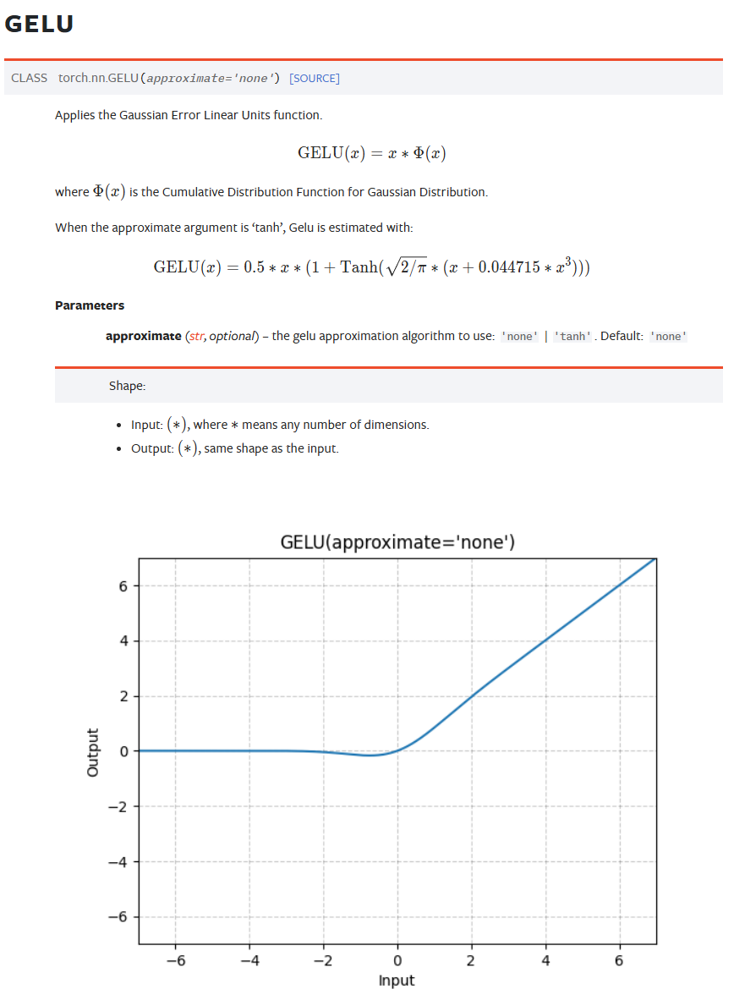
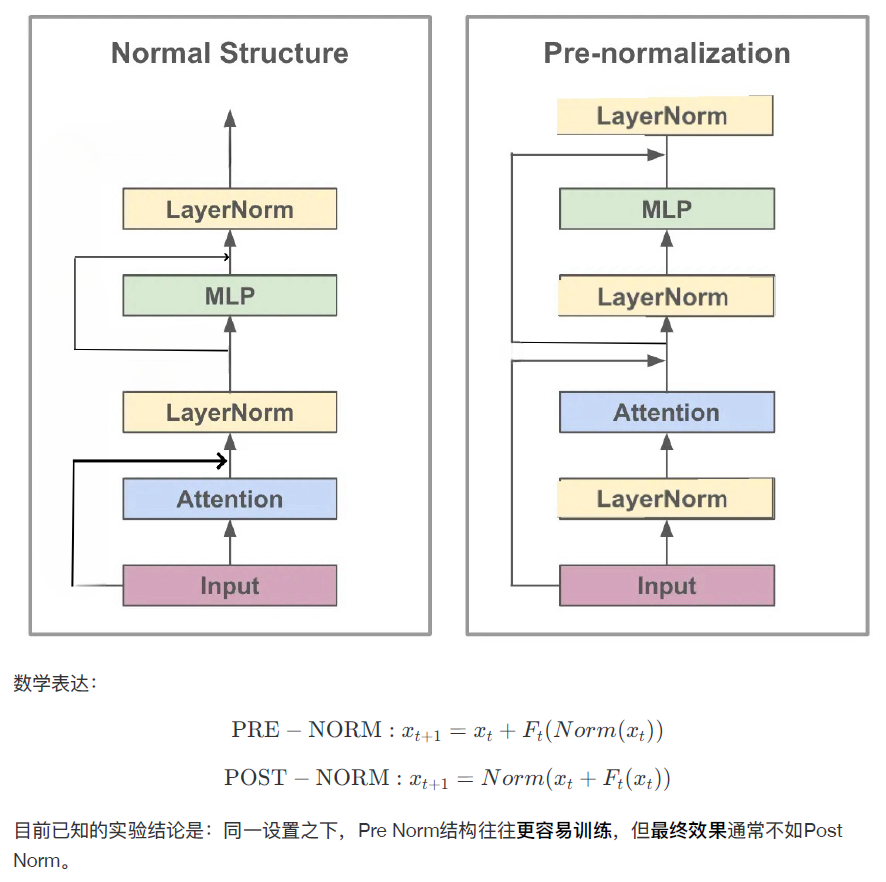
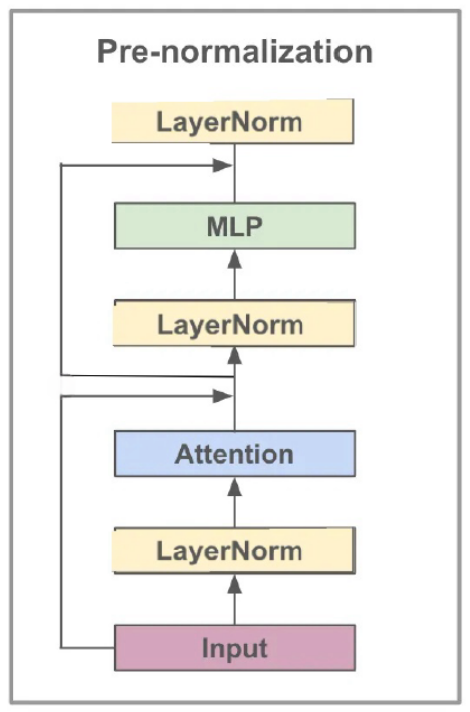
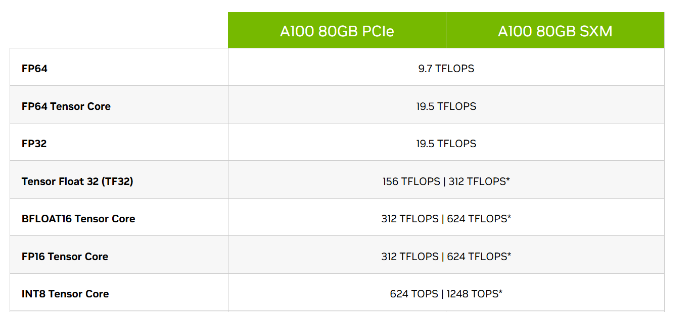
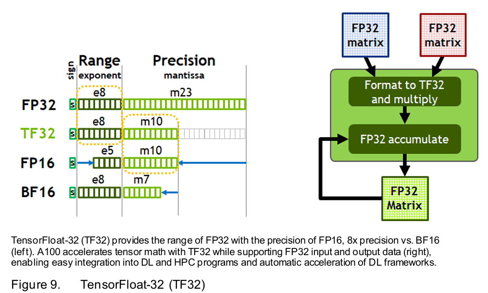
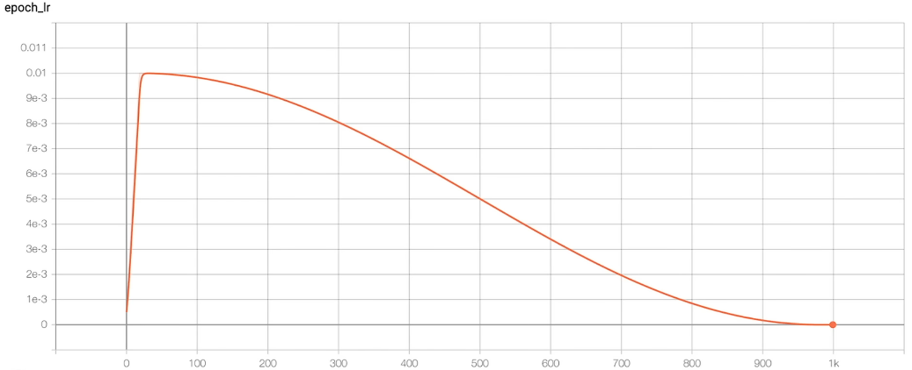

# First commit
## CausalSelfAttention: 将QKV和多头的运算，利用分块矩阵乘法的性质，只做一次矩阵乘法
1. 定义layer，3 * config.n_embd分别是QKV的weights
```python
# n_embed = n_head * head_size
# key, query, value projections for all heads, but in a batch
self.c_attn = nn.Linear(config.n_embd, 3 * config.n_embd)
# output projection
self.c_proj = nn.Linear(config.n_embd, config.n_embd)
```
2. QKV一次算出来，然后分成Q、K、V，再分成多头
```python
# 计算QKV然后分块
qkv = self.c_attn(x)
q, k, v = qkv.split(self.n_embd, dim=2)

# 分成多个头，每个头分别做self-attention
k = k.view(B, T, self.n_head, C // self.n_head).transpose(1, 2) # (B, nh, T, hs)
q = q.view(B, T, self.n_head, C // self.n_head).transpose(1, 2) # (B, nh, T, hs)
v = v.view(B, T, self.n_head, C // self.n_head).transpose(1, 2) # (B, nh, T, hs)
```

3. 对每个头分别做attention matrix的计算
```python
# Batched attention mechanisms
att = (q @ k.transpose(-2, -1)) * (1.0 / math.sqrt(k.size(-1)))
```
4. Attention mask是通过将希望mask的位置赋为-inf，使得softmax之后概率为0。
```python
# 实现注意力掩码，然后对Value做加权
att = att.masked_fill(self.bias[:,:,:T,:T] == 0, float('-inf'))
att = F.softmax(att, dim=-1)
y = att @ v # (B, nh, T, T) x (B, nh, T, hs) -> (B, nh, T, hs)
```
5. 合并每个head的结果，得到hidden_size与最初的embedding_dim相同 
```python
# .contiguous()确保返回一个连续的张量。
y = y.transpose(1, 2).contiguous().view(B, T, C) # re-assemble all head outputs side by side
```
6. 最后做一次proj (n_embed * n_embed)，得到hidden_states
```python
# output projection
y = self.c_proj(y)
```

## MLP层：采用GELU激活函数，采用一种近似估计
https://pytorch.org/docs/stable/generated/torch.nn.GELU.html 



## Small Summerize
- **Attention**: map, get the relationship across tokens.
- **MLP**: reduce, think individually.

## Block forward: layernorm前置，residual不做layernorm
1. We want clean residual pass way
2. 同一设置之下，Pre Norm结构往往更容易训练，但最终效果通常不如Post Norm。
https://kexue.fm/archives/9009



## GPTConfig() and GPT class
1. vocab_size的来源
```python
block_size: int = 1024 # max sequence length
vocab_size: int = 50257 # number of tokens: 50,000 BPE merges + 256 bytes tokens + 1 <|endoftext|> token
```
2. wte和wpe的维度
```python
# Token Embedding [50257, 768]
wte = nn.Embedding(config.vocab_size, config.n_embd),
# Positional Embedding [1024, 768]
wpe = nn.Embedding(config.block_size, config.n_embd),
```
3. from_pretrained 负责从预训练模型加载权重

# Add forward() function of GPT2 nn.Module
1. 输入的形状是(B, T)，即(batch, token_length)，这里的B是batched calculation计算一次的大小，并不等于用于更新梯度的batchsize，batchsize = B * T * num_accum_steps(需要串行的部分) * num_processes(可以放多张卡上并行)。token_length取决于设置的context_length，最多能根据多少个上文的token来预测下一个token。
2. 中间运算过程：先将token embedding和positional embedding加起来，其中pos embedding对于每一行相同，需要利用广播机制。然后，循环经过每个block，每个block中做attention和mlp，其中有前面提到的，clean residual和前置layernorm。最后做一次layernorm。相当于对下图，下面的部分迭代多次，再做最上面的layernorm。
   


3. 输出将hidden_states的维度 (B, T, n_embd) 经过 lm_head 映射到logits的维度(B, T, vocab_size)。每一行（总共B个句子）T个token，每个token都 tend to 前面的token，得到自己的hidden_state，以此预测自己的下一个token的概率。每一个位置预测的都是对应的下一个token的概率，(B, T)的输入得到的是(B, T)的预测输出，也就是将进行B*T次loss的计算。

# Generate from the model
1. 预测下一个token。因为是在做inference，所以只需要拿到最后一个token预测出的下一个token的logits即可。
```python
logits = model(x) # (B, T, vocab_size)
# take the logits at the last position
logits = logits[:, -1, :] # (B, vocab_size)
```
2. TopK选取概率最高的k个token，重新归一化，然后采样。这样可以避免sample到显然不合理的低概率值。topk_indices记录了选取的50个token到原词表中token的位置的映射。
```python
topk_probs, topk_indices = torch.topk(probs, 50, dim=-1)
```
3. torch.gather根据给定索引从一个张量中提取元素。
```python
# torch.gather(input, dim, index, out=None)
ix = torch.multinomial(topk_probs, 1) # (B, 1)
# gather the corresponding indices
xcol = torch.gather(topk_indices, -1, ix) # (B, 1)
```

# Autodetect device, and switch to a random model
检测一下当前的设备是什么，然后to(device)。

# Implement cross entropy loss in forward()
```python
# 将logit展成(B*T, vocab_size)，与target(B*T, 1)计算CE loss。
loss = F.cross_entropy(logits.view(-1, logits.size(-1)), targets.view(-1))
```

# Write simple dataloader and add an optimizer
尝试能否跑通训练过程。
```
using device: cuda
step 0, loss: 10.98649787902832
step 1, loss: 6.697659015655518
step 2, loss: 4.540412425994873
step 3, loss: 2.7975707054138184
step 4, loss: 1.6325037479400635
step 5, loss: 0.9096142053604126
step 6, loss: 0.508819580078125
step 7, loss: 0.2937222421169281
step 8, loss: 0.1840878278017044
step 9, loss: 0.12100420892238617
```

# Add a DataLoaderLite
1. Load the text and encode into tokens.
2. 核心是next_batch()，取下一个data batch。
```python
# 巧妙地错开一位，得到batched inputs和targets
buf = self.tokens[self.current_position : self.current_position+B*T+1]
x = (buf[:-1]).view(B, T) # inputs
y = (buf[1:]).view(B, T) # targets
# 顺序遍历整个语料，如果下一个batch将超过总长度，则重置读取位置
# advance the position in the tensor
self.current_position += B * T
# if loading the next batch would be out of bounds, reset
if self.current_position + (B * T + 1) > len(self.tokens):
    self.current_position = 0
```
3. Running output
```
using device: cuda
loaded 338024 tokens
1 epoch = 2640 batches
step 0, loss: 10.924686431884766
step 1, loss: 9.618416786193848
step 2, loss: 8.596650123596191
step 3, loss: 8.912147521972656
step 4, loss: 8.365449905395508
step 5, loss: 8.139814376831055
step 6, loss: 8.965357780456543
step 7, loss: 8.699417114257812
step 8, loss: 8.104934692382812
step 9, loss: 7.889430522918701
```

# lm_head and work token embedding should share parameters
1. 为什么可以共用参数？\
因为wte是embedding matrix，lm_head是unembedding matrix。共享参数之后，相似语义的token，有相近的token embedding，进而在hidden_stated经过lm_head后，被预测到有相似的logit。
2. 好处：这两部分参数量很大，共享参数能够显著减少参数量，使得数据能被更充分的利用，训练更加高效。
```python
# weight sharing scheme
self.transformer.wte.weight = self.lm_head.weight
```
3. It's a kind of **inductive bias**.

# GPT-2 Initialization
1. Set the bias to 0.
2. Scale the std of the nn.linear layer. 
3. Set the random seed.
```
"A modified initialization which accounts for the accumulation on the residual path with model depth is used. We scale the weight of residual layers at initialization by a factor of 1/sqrt(N) where N is the number of residual layers."
```

# Speedup the training process
## Set TensorFloat32 matmuls 
- Tensor Cores accelerate matrix multiplication by performing multiple multiply-accumulate operations simultaneously. 
- Tensor Cores can perform mixed-precision matrix multiplications and accumulate results in higher precision. 
- Run TensorCores in TF32 or BF16 is faster 




```python
# 设置 float32 矩阵乘法的内部精度
# 可以显著提高训练速度
torch.set_float32_matmul_precision('high')
```


```
using device: cuda
loaded 338024 tokens
1 epoch = 20 batches
step 0, loss: 10.935506820678711, dt: 1261.48ms, tok/sec: 12987.94
step 1, loss: 9.398406028747559, dt: 1028.11ms, tok/sec: 15936.10
step 2, loss: 8.941734313964844, dt: 1034.39ms, tok/sec: 15839.25
step 3, loss: 8.818684577941895, dt: 1031.17ms, tok/sec: 15888.78
step 4, loss: 8.487004280090332, dt: 1031.76ms, tok/sec: 15879.67
```
```
using device: cuda
loaded 338024 tokens
1 epoch = 20 batches
step 0, loss: 10.935468673706055, dt: 601.37ms, tok/sec: 27244.39
step 1, loss: 9.398317337036133, dt: 353.86ms, tok/sec: 46301.37
step 2, loss: 8.94157886505127, dt: 354.45ms, tok/sec: 46224.01
step 3, loss: 8.818318367004395, dt: 354.61ms, tok/sec: 46203.34
step 4, loss: 8.486916542053223, dt: 354.74ms, tok/sec: 46185.73
```

## Use bfloat16


1. Same exponent bits(range), different mantissa bits(precision). No need for gradient scaler.
2. torch.autocast实现Automatic Mixed Precision，以提高性能同时保持准确性。一些对精度敏感的运算，例如activations、loss保持FP32，而matmul、conv将转变为BF16。
```python
# 速度有一定提升
with torch.autocast(device_type=device, dtype=torch.bfloat16):
    logits, loss = model(x, y)
```

```
using device: cuda
loaded 338024 tokens
1 epoch = 20 batches
step 0, loss: 10.936103820800781, dt: 627.30ms, tok/sec: 26118.33
step 1, loss: 9.398155212402344, dt: 312.15ms, tok/sec: 52487.02
step 2, loss: 8.943115234375, dt: 311.01ms, tok/sec: 52680.04
step 3, loss: 8.822978019714355, dt: 310.76ms, tok/sec: 52721.59
step 4, loss: 8.487868309020996, dt: 311.29ms, tok/sec: 52632.83
```


## Use torch.complie
Speedup mainly comes from reducing Python overhead and GPU read/writes.
1. No need for python interpreter: torch.compile sees the entire code and turn it into efficient code.
2. Kernel fusion: reduce GPU read/write.
```python
# Take compilation time, but train faster.
model = torch.compile(model)
```
```
using device: cuda
loaded 338024 tokens
1 epoch = 20 batches
step 0, loss: 10.935880661010742, dt: 27732.57ms, tok/sec: 590.79
step 1, loss: 9.398301124572754, dt: 136.01ms, tok/sec: 120459.68
step 2, loss: 8.942550659179688, dt: 135.46ms, tok/sec: 120952.63
step 3, loss: 8.821760177612305, dt: 135.71ms, tok/sec: 120724.84
step 4, loss: 8.487848281860352, dt: 136.00ms, tok/sec: 120469.60
```

## Use Flash Attention
```python
# Flash Attention
y = F.scaled_dot_product_attention(q, k, v, is_causal=True) 
# Attention 
# (materializes the large (T,T) matrix for all the queries and keys)
# att = (q @ k.transpose(-2, -1)) * (1.0 / math.sqrt(k.size(-1)))
# att = att.masked_fill(self.bias[:,:,:T,:T] == 0, float('-inf'))
# att = F.softmax(att, dim=-1)
# y = att @ v # (B, nh, T, T) x (B, nh, T, hs) -> (B, nh, T, hs)
```
### A kernel fusion algorithm, which torch.compile cannot find
- Rewrite the implementation of attention mechanism.
- More Flops, but less memory read/write 
  * by making attention matrix never materialized
  * by online-softmax......

https://zhuanlan.zhihu.com/p/668888063

### Insights behind Flash attention
1. Be aware of memory hierarchy
2. Flops doesn't matter, the whole memory access pattern matters.
3. There are some optimization that torch.compile can't find.
```
using device: cuda
loaded 338024 tokens
1 epoch = 20 batches
step 0, loss: 10.9359130859375, dt: 15738.08ms, tok/sec: 1041.04
step 1, loss: 9.398147583007812, dt: 96.13ms, tok/sec: 170428.02
step 2, loss: 8.94234848022461, dt: 97.89ms, tok/sec: 167379.46
step 3, loss: 8.820586204528809, dt: 97.14ms, tok/sec: 168665.73
step 4, loss: 8.487573623657227, dt: 97.39ms, tok/sec: 168226.82
```

## Avoid ugly numbers: vocab_size 50257 -> 50304
- Single Instruction Multiple Thread: 实际上一个warp执行相同的指令，或者说执行同一个kernel function，一个warp包含32个thread，如果我们的参数不够好，可能会有remaining part导致耗费时间。
- 多出的vocab_size，对应的embedding将被置零，因为没有token对应到这些indices。
```
using device: cuda
loaded 338024 tokens
1 epoch = 20 batches
step 0, loss: 10.947336196899414, dt: 16484.30ms, tok/sec: 993.92
step 1, loss: 9.388265609741211, dt: 93.20ms, tok/sec: 175789.10
step 2, loss: 8.963359832763672, dt: 94.78ms, tok/sec: 172854.83
step 3, loss: 8.852533340454102, dt: 94.41ms, tok/sec: 173549.81
step 4, loss: 8.50554084777832, dt: 94.43ms, tok/sec: 173511.25
```

# Details of model training----refer to GPT-3
 ```
 To train all versions of GPT-3, we use Adam with 1 = 09, 2 = 095, and = 10 8, we clip the global norm of the gradient at 1.0, and we use cosine decay for learning rate down to 10% of its value, over 260 billion tokens (after 260 billion tokens, training continues at 10% of the original learning rate). There is a linear LR warmup over the first 375 million tokens. 
 
 We also gradually increase the batch size linearly from a small value (32k tokens) to the full value over the first 4-12 billion tokens of training, depending on the model size. 
 
 Data are sampled without replacement during training (until an epoch boundary is reached) to minimize overfitting. 
 
 All models use weight decay of 0.1 to provide a small amount of regularization.
 ```
## AdamW hyperparameters
```python
optimizer = torch.optim.AdamW(model.parameters(), lr=3e-4, betas=(0.9, 0.95), eps=1e-8)
```

## Clip the gradient
- Computes the total gradient norm (e.g., L2 norm across all parameters by default).
- If the norm exceeds the specified max_norm, the gradients are scaled down proportionally.
- Helps stabilize training, especially when using high learning rates or large models, by preventing gradient explosion.
```python
# torch.nn.utils.clip_grad_norm_(parameters, max_norm, norm_type=2.0)
norm = torch.nn.utils.clip_grad_norm_(model.parameters(), 1.0)
```
```
using device: cuda
loaded 338024 tokens
1 epoch = 20 batches
step    0 | loss: 10.947336 | norm: 28.5686 | dt: 6138.27ms | tok/sec: 2669.16
step    1 | loss: 9.388454 | norm: 6.1851 | dt: 95.02ms | tok/sec: 172430.22
step    2 | loss: 8.949810 | norm: 2.4907 | dt: 96.79ms | tok/sec: 169278.56
step    3 | loss: 8.764482 | norm: 2.8624 | dt: 96.54ms | tok/sec: 169712.50
step    4 | loss: 8.771492 | norm: 10.1790 | dt: 96.01ms | tok/sec: 170650.22
step    5 | loss: 8.454670 | norm: 2.0210 | dt: 96.12ms | tok/sec: 170454.23
step    6 | loss: 8.338696 | norm: 2.4302 | dt: 96.32ms | tok/sec: 170096.03
step    7 | loss: 8.064600 | norm: 1.7912 | dt: 96.30ms | tok/sec: 170143.20
step    8 | loss: 7.772311 | norm: 2.0319 | dt: 95.98ms | tok/sec: 170696.84
step    9 | loss: 7.520995 | norm: 1.5736 | dt: 96.44ms | tok/sec: 169895.02
```

## Learning rate scheduler


## Add weight decay and fused AdamW
- The "W" in AdamW stands for "Weight Decay".
- Prevent overfitting by adding a penalty (**L2 regularization**) to the loss function.
- AdamW decouples weight decay from the optimization steps. The weight decay is applied directly to the parameters rather than being mixed with the gradient updates.
$$
\theta_{t+1} = \theta_t - \eta \cdot \nabla_{\theta} J(\theta_t) + \lambda \cdot \theta_t
$$
```python
# 筛选所有需要梯度更新的参数
# start with all of the candidate parameters (that require grad)
param_dict = {pn: p for pn, p in self.named_parameters()}
param_dict = {pn: p for pn, p in param_dict.items() if p.requires_grad}
# 只对维度大于2D的参数做weight decay
# create optim groups. Any parameters that is 2D will be weight decayed, otherwise no.
# i.e. all weight tensors in matmuls + embeddings decay, all biases and layernorms don't.
decay_params = [p for n, p in param_dict.items() if p.dim() >= 2]
nodecay_params = [p for n, p in param_dict.items() if p.dim() < 2]
optim_groups = [
    {'params': decay_params, 'weight_decay': weight_decay},
    {'params': nodecay_params, 'weight_decay': 0.0}
]
```
```python
# 如果有fused函数参数且在gpu上运行，则使用kernel fusion for AdamW optimization
# Create AdamW optimizer and use the fused version if it is available
fused_available = 'fused' in inspect.signature(torch.optim.AdamW).parameters
use_fused = fused_available and 'cuda' in device
print(f"using fused AdamW: {use_fused}")
optimizer = torch.optim.AdamW(optim_groups, lr=learning_rate, betas=(0.9, 0.95), eps=1e-8, fused=use_fused)
```